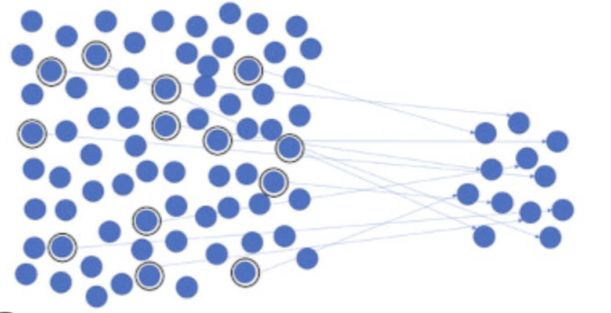

```{r setup, include=FALSE}
knitr::opts_chunk$set(echo = TRUE)
```

# Conceptos Iniciales

## Inferencia Causal

Cuando hablamos de un proceso de inferencia causal nos referimos al proceso de hacer afirmaciones sobre una $población$ basándonos en una $muestra$ representativa compuesta de $unidades$  (misma que dependerá de diferentes supuestos), particularmente, usaremos estos dos conceptos para entender el efecto de un fenómeno ocurrido de la $muestra$ sobre la $población$, buscando si es $estadísticamente \ significativo$ para establecer una relación $causal$.

## Modelo de Rubin, Holland 

Una afirmación ya bastante conocida es que correlación no implica causalidad, sin embargo no resulta muy claro el camino a seguir estadísticamente para crear un modelo causal, una parte importante es establecer el concepto de $aleatoreidad$ lo cual obedece a un $proceso \ generador \ de \ datos $ el cual puede se puede aislar  bajo sus propias condiciones. 

Retomando los conceptoa anteriores, consideraremos una $población$, $muestra$ y $unidades$, de las últimas podremos establecer $funcione$ que traduciremos como $variables$. 

En ese sentido, podemos definir los componentes del modelo como: 

* Unidad : Un objeto $i$ en un punto del tiempo específico. 
* Tratamiento : Una intervención $t$, cuyos efectos queremos estimar comparando con un $control / c$ determinado por la ausencia de intervención. 
* Estado del mundo: $S$ para la unidad $i$ la cual tiene un estado de tratamiento definido por $S \in {t,c}$. 
* Resultado potencial: Antes de que el tratamiento es asignado, podemos estimar la medición de nuestro resultado de interés $Y$ para cada unidad $i$, bajo ambos tratamiento y control, identificados como $Y_{i}^{t}$ y $Y_{i}^{c}$.
* Mecanismo de asignación: El algoritmo que determina si cada $i$ recibe $t$ o $c$.
* Efecto causal: La diferencia entre el resultado potencial para una unidad dada: $Y_{i}^{t} - Y_{i}^{c} = T_{i}$. 


Una vez que $S = c$ podemos obtener el $efecto /del tratamiento$ como $Y_{i}^{t} - Y_{i}^{c} = T_{i}$. No obstante una vez que $S$ está determinado solo observamos un resultado, nunca podemos observar dos resultados potenciales para la misma unidad, a esto se refiere el Problema Fundamental de la Inferencia Causal, es decir, es imposible observar el valor de  $Y_{i}^{t}$ y $Y_{i}^{c}$ para la misma unidad y por tanto, es imposible observar el efecto de $t$ contra $c$ para una $i$ en particular.  

// 

Una solución al problema anterior es, en lugar de concentrarnos en calcular $T_{i}$ calculamos $T$ que será el $Efecto / medio / de/  tratamientoo$ calculado como: $T = E(Y_{i}^{t} - Y_{i}^{c}) = E(T_{i}) $ el cual se obtiene directamente recordando que la media es un operador lineal. 

Aunque no siempre podemos observar $T$, podemos estimarlo de la siguiente forma: 

$\hat{T} = \hat{E}(Y_{i}^{t}| S=t) - \hat{E}( Y_{i}^{c}|S=c)$

Generalmente $\hat{T}$ es un buen estimador de $T$ (no quiere decir que sea el único), lo cual depende del mecanismo de asignación.


Consideremos: $E(Y_{i}^{t}) = (Y_{i}^{t}| S=t)$ y $E(Y_{i}^{c}) = (Y_{i}^{c}| S=c)$

Entonces  $E(\hat{T}) = T$ se cumplirá si $S$ es independeinte de $Y$, entonces el grupo tratado es una muestra aleatoria del grupo de los potencialmente tratados, mismo caso para el grupo de control. 

Notemos entonces que la asignación aleatoria de $S$ hace que la independencia sea plausible pero no testeable. 

## Problema de identificación. 

Cuando el supuesto de independencia entre $S$ y $Y$ cuando hay alguna relación a priori entre ambos, por ejemplo, si el tratamiento es parte de un procceso de optimización que involucra al resultado, caso que es común. 

A partir de lo anterior, nos referimos al problema de identificación a la dificultad de obtener un estimador insesgado para identificar parámetros causales a menos que el mecanismo de asignación cumpla con distintas condiciones. 


## Organización y estructura de datos.

### Vectores

Los vectores se usan regularmente para establecer una secuencia numérica, cada elemento del vector revela información sobre los datos en general, se representan comunmente como: $(S_{1}.... S_{6})$, en este caso se tratará de un vector de 6 elementos. 

### Matrices

Las matrices son objectos relacionados en dos dimensiones los cuales crean combinaciones de fila-columna, se representan comunmente como: 

\begin{equation}
\begin{pmatrix}
  a_{a}       & b_{a}   & c_{a}  & d_{a}  \\
  a_{b}      & b_{b}  & c_{b}  & d_{b}  \\
  a_{c}       & b_{c}   & c_{c} & d_{c}  \\
  a_{d}       & b_{d}   & c_{d} & d_{d}  \\
\end{pmatrix}
\end{equation}
=

\begin{equation}
\begin{pmatrix}
  1       & 2   & 3  & 4  \\
  8      & 7  & 6  & 5  \\
  9       & 10   & 11 & 12  \\
  13       & 14   & 15 & 16  \\
\end{pmatrix}
\end{equation}

### Data frame

Un data frame contendrá información sobre múltiples unidades para diferentes vectores, los elemtnos que contienen este data frame regularmente a nivel de fila tendrán identificadores, aunque no siempre puede darse el caso en el que la información esté idenxada, esta última característica será útil si queremos agrupar nuestros datos. 

### Tipos de variables 

* Variables binarias: sólo pueden tomar dos valores de un conjunto discreto. 

* Variables categóricas: capturan si la unidad del dato está clasificada en un rango de categorías. 

* Variables ordinarias: capturan información en un rango particular. 

* Variables continuas: capturan datos en un margen más amplio, generalmente son datos numéricos en un conjunto continuo. 

## Obtención de datos 

* Descargas directas: generalmente son datos con una estructura definida, son de fácil acceso a través de links descargables. 

* Scrapeo de datos: es un proceso de automatización comunmente realizado en R o Python, en el cual se obtienen datos de cada link en una página o bien se retoman usando la estructura HTML de la página en cuestión. 

* Data Capture: son datos que se encuentran previamente clasificados, generalmente siguen una estructura estadística. 


* API: es una fuente en la que podemos acceder más directamente a los datos a través de código, generalmente los datos se encuentran en foramto JSON. 


## Teorema del Límite Central 

* Muestra aleatoria: se refiere a una realización aleatoria de un conjunto de objetos en un data frame, esperamos que al tomar subconjuntos de dicha muestra:

    * La media de ese subconjunto converga (en media) a la             media de la muestra completa.
  
    * La varianza de ese subconjunto sea representativa a la          varianza de nuestra muestra completa. 
    
* Lo anterior se cumplirá sí y sólo sí los datos son independientes e idénticamente distribuidos (no hay ninguna conexión entre las observaciones o filas para un dataframe), es decir, si no hay subgrupos en la población que podrían tener resultados correlacionados. 

* Si quisíeramos hacer algún tipo de inferencia partiendo de los grupos de un data frame tenemos que usar el método de aleatorización estratificada para asegurarnos de considerar submuestras representativas para cada subgrupo. 


## Distribuciones: nos muetran el comportamiento las varibales aleatorias, y son particularmente útiles para realizar pruebas de hipótesis. Podemos distinguir entre: 

  * Discretas: Involucran descontinuidades escalonadas en la        densidad, también tienen la naturaleza de mostrar realizaciones binarias, es por eso que los ejemplos más comunes son las distribuciones Bernoulli y Binomial. 
  * Continuas: Tienen una forma suavizada, son un caso de una        distribución discreta, la forma más común es la distribución normal (Gaussiana)
  
* Lo anterior nos sierve para establecer el Teorema del Límite Central, el cual establece que conforme el número de realizaciones aumenta, la media muestral tiene a distribuirse de forma normal alrederor la media de la población, también la desviación estandar tiende a disminuir conforme $n$ disminuye (a causa de la convergencia en media). 

* Para una realización aleatoria podemos hacer inferencias sobre qué podría ser representativo de nuestra población, conforme agregamos más datos, nuestra inferencia se vuelve más robusta. 
  


```{r, out.width="50%"}



```

## Analítica Descriptiva: Medidas de dispersión y localización

### Medidas de localización/tendencia central

Consideremos que la localización central de un data frame (para un vector) requiere considerar diferentes medidas de tendencia central como: 

* Media: También llamada Esperanza o Valor Esperado y denotado comunmente como $\bar{X}$ es igual a la suma del vector dividido entre su longitud (notemos que este valor indirectamente que el peso de cada valor en el vector es el mismo en términos de probabilidad). 

* Mediana: El valor que se encuentra justo en medio del vector listado (el número de valores previos y posteriores es el mismo aproximádamente). 

* Moda: El valor con más ocurrencia en el vector. 

### Medidas de dispersión

Generalmente los datos están distribuidos alrededor de una tendencia central, para organizarlos mejor distinguimos entre: 

* Rango: Diferencia entre el valor más pequeño y el más grande en una secuencia numérica (vector numérico).

* Percentiles/Quartiles: Muestran al densidad de la distribución sobre un punto en particular. 

* Rango IQ: Distancia entre dos segmentos de datos. 

* Varianza: Suma de los datos estandarizados (restándoles la media) divivido entre $n-1$, es decir: $\sigma^2 = 1/n-1 \sum_{1}^n (X_{i} - \bar{X})^2$ recordemos que la Desviación estándar es la raíz cuadrada de la Varianza (i.e $\sigma$).


### Correlación

* La correlación nos ayuda a evaluar la relación entre dos variables ($X$, $Y$; o más), la visualización más común es el gráfico de dispersión donde podemos observar como cuando un vector aumenta su valor, los valores del otro vector aumentan (relación directa), disminuyen (relación inversa) o se quedan igual (no hay relación), podemos obtener la correlación calculando $\sum_{1}^n (X_{i} - \bar{X})(Y_{i} - \bar{y})/ SD^X SD^Y$, esta medida deriva de la covarianza y es importante mencionar que la correlación no implica causalidad. 

## Visualizaciones

* Tablas 

* Boxplots

* Histogramas 

* Densidad 


## Randomized Control Trials (RCTs)

Partiendo del modelo de Rubin, podemos recordar que si el tratamiento es determinado de forma aleatoria, entonces la independencia en la muestra es plausible (mas no garantizada), los RCTs hacen uso de este supuesto para generar modelos de asignación aleatoria. Algo importante a diferencias son los tratamientos exógenos vs los endógenos.

* La idea detrás es que cuando los agentes eligen el estado del mundo $S$ (endógeno) dependederá en los resultados $Y$.

* Por otro lado, si es exógeno podemos definir un "agente optimizador fuera del control" que hace la independencia plausible. 

Lo anterior se puede entender también en un problema de exogeneidad sobre una regesión continua, lo cual le resta robustez y significancia estadística a nuestro modelo y por tanto a la intepretación causal de los resultados, cuando hacemos un RCT la idea principal es resolver el problema de endogenidad teniendo una muestra independiente a priori, aunque también podemos encontrarnos con el problema de una aleatorización pobre, una forma de verificar que no ocurre dicho problema es realizando balance tests, los cuales buscan verificar la independencia del estado del mundo $S$ con las características exógenas (no el resultado $Y$).


## Limitantes de los RCT

### Beneficios:

* Dado que podemos establecer independencia a priori, el problema de identificación se resuelve fácilmente, pudiendo establecer un efecto causal. 

### Limitantes o problemas potenciales:

* Aleatorización fallida 
* Desgaste (Attrition)
* Efectos en equilibrio general
* Practicidad 
* Validación externa
* Sesgo por elección


Attrition: Algunos participantes pueden dejar el estudio, el problema está en que no podremos encontrar $Y$ de las personas que abandonan el estudio, si el attrition no está correlacionado $Y^{s}$, no será un problema, dado que aún se podrá tener independencia de $S$ y $Y^{t}$ y $Y^{c}$ en el resto de la muestra, si el attrition está correlacionado con $Y^{S}$ y el tratamiento cambia el attrition entonces la indepedencia se rompe, necesitaríamos: 

$E[Y^{S}|S = s, observada] = E[Y^{S}, observada]$

Observaríamos un conjunto no aleatorio de los resultados tratados. 


## Compliance y la intención a ser tratado (ITT)

En algunas ocasiones también las personas se pueden negar a tomar el tratamiento, también puede darse el casp que las personas del grupo de control busquen tratarse fuera del programa, si es que se observan los resultados, se puede obtener un estimador válido del parámetro sobre la intención a ser tratado (ITT), podemos entender mejor lo anterior a través de la siguiente Matrix de Compliance: 

|   |      Assignación t      |  Assignación c |
|----------|:-------------:|------:|
| Recibo t |  A | B |
| Recibo c |    C   | D |


En este caso, A y D son compliers, mientras que B y C no lo serán. De inicio, podríamos pensar que nuna buena opción sería la de comparar A y B contra C y D, pero se perdiría la independencia dado que tenemos agentes endógenos que eligen en el estado del tratamiento, esto porque la asignación de $t$ o $c$ no necesariamente implica que hayan recibido $t$ o $c$ necesariamente. 

De tal forma se desarrolla el concepto de la intención a ser tratado, el cual compara A y C así como B y D, si todos los agentes son compliers entonces se cumplirá que ITT = ATT.


## Efectos en Equilibrio General

Ocurre cuando el grupo de control es afectado por el tratamiento, puede darse debido a efectos en equilibrio general o bien a efectos de pares (peer effects), en caso que se identifiquen esos efectos de forma potencial, el RCT debe de ser rediseñado para prevenirles, lo cual regularmente reduce el tamaño de la muestra efectiva a través de clusters.


## Practicidad y validación. 

* Ética: Hay experimentos que pueden generar estrés financiero o una situación poco deseable para la muestra. 

* Factibilidad: Existe una limitante sobre los recursos que podemos usar y el escenario que podemos plantear. 

* Costo: Los RCT's tienden a ser costosos en comparación con los estudios observacionales. 

* Validación externa: Una estimador será válido internamente si es un estimador insesgado para la población del experimento, también será válido externamente si es un estimador insesgado para la población fuera del experimento, no todos los RCT tienen validación externa pero se busca que la tengan. 

Los RCT's serán nuestro marco estándar para estimar una inferencia causal a causa de que la independencia es plausible al controlar aleatoriamente el mecanismo de asignación, resolviendo el problema de identificación, por eso cuando examinamos datos observacionales (no experimentales) siepre es buena idea comparar con el RCT inicial para comprender los problemas potenciales, aunque es importante tener en mente las limitantes de los RCTs, teniendo claro el tipo de estimación que queremos obtener, así como los parámetros que son creíbles para estimar, considerando attrition, compliance, equilibrio general, etc.

### Regresión Bivariada 

También llamada OLS(Ordinary Least Squares) Bivariada o Mínimos Cuadrados Ordinarios Bivariado, nos ofrece un modelo en el que se ajusta una línea entre dos variables X y Y, por lo que se asume de inició una relación lineal entre X y Y tal que: 

\begin{equation}
Y = \beta_{0} + \beta_{1}X + u
\end{equation}

MCO (OLS) será el método para estimar la pendiente $\beta_{1}$ y el intercepto $\beta_{0}$, aunque también se podrá estimar a través de máxima verosimilitud. 

La ecuación estándar de regresión para una población será: 

\begin{equation}
Y_{i} = \beta_{0} + \beta_{1}X_{i} + u_{i}
\end{equation}

Donde:

* $Y_{i}$ es la variable dependiente.
* $X_{i}$ es la variable independiente. 
* $\beta_{0}$ es la constante/intersecto verdadera.
* $\beta_{1}$ es la pendiente verdadera. 
* $u_{i}$ es el término de error verdadero.


Por otro lado, nuestros estimadores serán marcados con un "sombrero" de la siguiente forma: 

* $\hat{\beta}$ será el estimador del coeficiente. 
* $\hat{Y_{i}}$ será el valor predecido.

Por lo que $\hat{Y} = \hat{\beta_{0}} + \hat{\beta_{1}} X_{i}$

* $\hat{u_{i}}$ es un residuo. 

Por lo que $ \hat{u_{i}} = Y_{i} - \hat{Y_{i}} = Y_{i} - \hat{\beta_{0}} - \hat{\beta_{1}} X_{i}$

Observamos $X$ y $Y$ y estimamos $\beta$ y $u$.


## Mínimos Cuadrados Ordinarios (MCO)

Sigue una lógica de optimización en la que se minimizan las desviaciones de los valores predecidos con los valores reales en los datos, generalmente toma una muestra de tamaño $n$ dado por: 


\begin{equation}

min_{b_{o}b_{1}} = \sum_{i}^{n}(Y_{i} - b_{0} - b_{1}X_{i})^2

\end{equation}

Los residuos se refieren a los errores que el modelo está haciendo, los cuales están dados por $\bar{u_{i}} = Y_{i} - \hat{\beta_{0}} - \hat{\beta_{1}} X_{i}$, podemos reescribir el problema de MCO como: 


\begin{equation}
min_{b_{o}b_{1}} \sum_{i=1}^{n} (\tilde{u_{i}})^2
\end{equation}

donde $\tilde{u_{i}} = Y_{i} - b_{0} - b_{1}X_{i}$, la solución dada por MCO minimiza la suma de los residuos al cuadrado, es decir mnimiza la distancia vertical entre los puntos. 


```{r, out.width="50%"}

knitr::include_graphics("OLS.png")

```

Notemos sin embargo que $\hat{\beta_{0}}$ y $\hat{\beta_{1}}$ son los valroes de $\beta_{0}$ y $\beta_{1}$ que minimizan la suma de residuos al cuadrado, donde cada uno está dado por: 


\begin{equation}

\hat{\beta_{1}} = \frac{\sum_{i=1}^{n}(X_{i} - \bar{X}) (Y_{i} - \bar{Y})} {{\sum}_{i=1}^{n} (X_{i} - \bar{X})^2}
\end{equation}

\begin{equation}
 =  \frac{\hat{Cov(X,Y)}}{\hat{Var(X)}} = \frac{S_{XY}}{S_{X}^2}
\end{equation}


\begin{equation}
\hat{\beta_{0}} = \bar{Y} - \hat{\beta_{1}}\bar{X}
\end{equation}

Donde 

$\hat{X} = \frac{1}{n} \sum_{i=1}^{n} X_{i}$ es la media muestral de X.

y $\hat{Y} = \frac{1}{n} \sum_{i=1}^{n} Y_{i}$ es la media muestral de Y.

El método de MCO nos ayuda a encontrar $\hat{\beta_{s}}$, lo cual define el valor predecido y los residuos. 

Los valores predecidos ($\hat{Y}$ es el modelo estimado de $Y_{i}$ dado $X_{i}$): 

\begin{equation}
\hat{Y_{i}} = \hat{\beta_{0}} + \hat{\beta_{1}}X_{i}
\end{equation}

Predice los valores a partir de los estimadores de MCO usando medias condicionales: 

\begin{equation}
E(Y_{i} | X_{i}) = \beta_{0} + \beta_{1}X_{i}
\end{equation}

\begin{equation}
\hat{E}(Y_{i} | X_{i}) = \hat{\beta_{0}} + \hat{\beta_{1}}X_{i} = \hat{Y_{i}}
\end{equation}

Los valores predecidos son las mejores aproximaciones de $Y_{i}$ cuando sabemos $X_{i}$.

Los residuos serán la diferencia entre los resultados veraderos y los valores predicidos. 

\begin{equation}
\hat{u_{i}} = Y_{i} - \hat{Y_{i}} = Y_{i} - \hat{\beta_{0}} - \hat{\beta_{1}}X_{i} 
\end{equation}


## Supuestos importantes para MCO - Teorema de Gauss - Markov 

MCO será un "buen" método para estimar una relación causal entre $X$ y $Y$ a través del estimador/pendiente $\hat{\beta_{1}}$, se necesitará que: 

1. Los parámetros verdaderos sean causales. 
2. MCO deberá proporcionar un buen "estimador" de los valores reales. 

Recordemos que $\hat{\beta_{0}}$ y $\hat{\beta_{1}}$ son variables aleatorias, no constantes, por lo que un "buen" estimador deberá de ser insesgado y preciso/eficiente. 

Pensemos que queremos estimar a través de MCO la siguiente relación lineal entre $X$ y $Y$: 

\begin{equation}
 Y_{i} = \beta_{0} + \beta_{1}X_{i} + u_{i}, i = 1,...,n 
\end{equation}


MCO será el mejor estimador bajo los siguientes supuestos para todo $i$: 

1. $E(u_{i}|X_{i}) = 0 $ para todos los valores de $X_{i}$.
2. $(X_{i}, Y_{i}$ son independientes e identicamente distribuidas.
3. Los outliers son poco comunes (curtosis finita).
4. $var(u_{i}|X_{i}) = \sigma_{u}^2$ para todos los valores de $X_{i}$ (homocedasticidad).


## Supuesto 1: $E(u_{i}|X_{i}) = 0$ 

Media condicional igual a cero, se refiere a que la tendencia central de la distribución del término de error $u_{i}$ no está relacionado a $X_{i}$, es decir la media de $u$ es la misma para cualquier valor de $X$. 

Notemos que $E(u_{i})=0$ no es relevante acá, nos importa $E(u_{i}|X_{i})$ (esto dado que la media condicional es el mejor predictor lineal en general) sea la misma para todos los valores de $X$ i.e, $E(u_{i}) = E(u_{i}|X_{i})$, aunque notemos que $E(u_{i} = )$ mientras que la regresión tenga una constante 

El supuesto de la media condicional igual a cero es más fuerte que el supuesto de no correlación, es decir: 

* $E(u|X) = 0 \implies corr(u,X) = 0 $ pero 

* $corr(u,X) = 0  \notimplies E(u|X) = 0 \newcommand{\notimplies}{\;\not\!\!\!\implies}$

Notemos que el hecho de que nuestro témino de error $u$ y $X$ estén no correlacionados es una condición necesaria pero no suficiente para que el supuesto 1 se cumpla, podemos ilustrar esto de la siguiente forma: 

\begin{equation}
 wage = \beta_{0} + \beta_{1}educ + u
\end{equation}

Necesitamos considerar los factores que serán capturados por $u . E(u|educ) = o$ implica por ejemplo que $E(u|trunca$ = $E(u|grduado$. Esto debido a que existen elemntos que no se capturan con educación en nuestro modelo inicial y serán capturados por $u$, por lo que $u$ podría ser la ambición, inteligencia, condiciones de mercado laboral locales, salud, etc. 
Cualquier cosa que determine $Y$ y no esté en $X$ estará en nuestro "término de error", incluyendo las lurking variables, las cuales serán variables que pueden aparentar tener un nexo causal fuerte de forma errónea. 

Si $X$ está correlacionado con el término de error, el supuesto 1 será violado, y sí $X$ es asigndo aleatoriamente, entonces no esperaíamos que el término de error esté correlacionado con $X$, en un RCT el tratamiento es asignado aleatoriamente por lo que el supuesto 1 es plausible. 

Por tanto, si el supuesto 1 se cumple entonces esperaríamos que: 

1. Los residuos $\hat{u}$ siempre estarán no correlacionados a $X$. 

2. Los residuos $\hat{u}$ siempre tendrán media cero. 

3. Si corremos la regresión $\hat{u} = \delta_{0} + \delta_{1}X + \epsilon$ entonces obtenemos $\hat{\delta_{0}} = \hat{\delta_{1}} = 0 $ siempre. 

4. Los residuos no están correlacionados con $X$ por construcción. 

5. Nos importa si el error está correacionado o no correlacionado con $X$.

Por tanto, no podremos testear si $E(u|X) = 0$ checando si $E(\hat{u}|X) =0 $ dado que esto último siempre es cierto, tampoco podríamos si se cumple $E(u|X) = 0$ directamente dado que nunca observamos $u$, por lo que tendremos que decidir si el supuesto 1 es plausible dada la información que sabemos de los datos (por lo que resulta importante pensar en el mecanismo de asignación), otra opción sería observar las relaciones no lineales entre $\hat{u}$ y $X$. 


## Supuesto 2: $(X_{i},Y_{}i)$ son independientes e identicamente distribuidas.

Consideremos que cada unidad de los datos proviene de una realización de la misma población y cada realización es independiente entre sí, notemos que los datos panel generalmente violan esa condición, las series de tiempo también violan ese supuesto regularmente. 


## Supuesto 3: Los outliers son "poco comunes". 

Es decir $X$ y $Y$ tienen curtosis finita, haciendo referencia al cuarto momento central i.e : $ 0 < E(X^4) < \infty$, esta condición también nos sirve para asegurar que tienen una varianza y covarianza finita y bien definida. 

## Insesgadez de MCO 

Consideremos el siguiente modelo especificado para la población: 

\begin{equation}
Y_{i} = \beta_{0} + \beta_{1}X_{i} + u_{i} 
\end{equation}

Si los supuestos 1-3 se cumplen entonces tendremos: 


\begin{equation}
  E(\hat{\beta_{0}}) = E(\beta_{0}) 
\end{equation}

\begin{equation}
  E(\hat{\beta_{1}}) = E(\beta) 
\end{equation}


Donde \hat{\beta_{0}} y \hat{\beta_{1}} son estimadores del MCO, lo cual será cierto sin importar la muestra $n$. 

## Aproximaciones a la normal (teoría asintótica)

Cuando tenemos una $n$ lo suficientemente grande, la distribución de $\hat{\beta}$ se aproxima de forma cercana a la normal, i.e: 


\begin{equation}
  \hat{\beta_{1}} N(\beta_{1}, \sigma_{\hat{\beta_{1}}}^2)
\end{equation}

\begin{equation}
  \sigma_{\hat{\beta_{1}}}^2 = \frac{1}{n} \frac{var [( X - \mu_{X})u ]}{ var(X)^2}
\end{equation}

Donde $\mu_{x}$ es la media de la población $X$. 

En este caso usaremos una aplicación del teorema del límite central y nos ayudará a hacer pruebas de hipótesis de forma analítica. 

Generalmente se sugiere nuestra muestra $n >100$ sera suficientemente grande, aunque esto depende en las características de los datos, en algunos casos incluso muestras grandes no serán suficientes dado que no existe suficiente independencia entre los puntos.


## Supuesto 4: Homoscedasticidad. 

Notemos que aunque es posible $E(u|X)=0$ pero $var(u|x)$ puede variar en $X$, si la varianza de de $u$ es diferente para diferentes niveles de $X$, diremos que el término de error es heterocedastico, aunque notemos que si el término de error es homoscedastico entonces nuestros estimadores de MCO serán mejores pero la homoscedasticidad no se requiere para que nuestro MCO sea insesgado 


## Mejor Estimador Lineal (MEL)

Cuando los supuestos 1-4 se cumplen entonces MCO será el mejor estimador lineal, el cual será 1. el más eficiente/mejor, 2. Lineal (en contraposición con modelos no lineales o de máxima verosimilitud), 3. Insesgado condicionalmente y 4. Estimador. 


## Variaciones en los estimadores MCO 

Recordemos que $\hat{\beta_{1}}$ es una variable aleatoria, por lo que tendrá una media y si los supuestos 1-3 se cumplen, entonces será insesgado, i.e: 

\begin{equation}
E(\hat{\beta_{1}}) = \beta_{1}
\end{equation}

Y tiene una desviación estándar de $\sigma_{\hat{\beta{1}}}$: 

\begin{equation}
  \sigma_{\hat{\beta_{1}}}^2 = \frac{1}{n} \frac{var [( X - \mu_{X})u ]}{ var(X)^2}
\end{equation}

Donde $n$ es una muestra, el denominador es la varianza de $X$ al cuadrado.

Sin embargo, es importante preguntarnos: ¿qué determina la precisión de los estimadores MCO? 

Pensemos en el caso homoscedastico: 


\begin{equation}
  \sigma_{\hat{\beta_{1}}}^2 = \frac{1}{n} \frac{var [( X - \mu_{X})u ]}{ var(X)^2}
\end{equation}

\begin{equation}
         = \frac{1}{n} \frac{var(X) var(u)]}{ var(X)^2}
\end{equation}

\begin{equation}
         = \frac{1}{n} \frac{var(u)}{ var(X)^2} = \frac{1}{n} \frac{\sigma_{u}^2}{\sigma_{X}^2} 
\end{equation}

Es decir que tendremos:

\begin{equation}
         = \frac{1}{n} \frac{\sigma_{u}^2}{\sigma_{X}^2} 
\end{equation}

\begin{equation}
        = \frac{1}{\sqrt{n}} \frac{\sigma_{u}}{\sigma_{X}} 
\end{equation}

La precisión de (\frac{1}{var}) del estimador MCO es mayor mientras: 

* El tamaño de la muestra $n$ aumente. 
* La varianza de $u$ disminuya.
* La varianza de $X_{i}$ aumente.

La intuición será que tendremos que observar $Y$ para un rango más grande de $X$ para obtener más información. 


```{r, out.width="75%"}

knitr::include_graphics("Precision_OLS.png")

```

En el gráfico podemos ver que si bien en ambos casos muestran la verdadera $\beta$, habrá más varianza en $X$ del lado derecho, sin embargo ¿cómo podemos saber cuál caso será más preciso? una manera de hacerlo es a través de simulaciones, en tal caso podríamos usar una simulación Monte Carlo como en el siguiente ejemplo:


```{r, out.width="65%"}

knitr::include_graphics("MonteCarlo.png")

```

Podemos ver que al momento de hacer una simulación Monte Carlo con la misma $\beta$ real, mismo $n$ y mismo $\sigma_{u}$ pero con mayor varianza en $X$ del lado derecho será más preciso dado que obtenemos más información sobre la distribución de $\hat{\beta_{1}}$

## Medición de ajuste : R cuadrada. 

Recordemos que tenemos: 
\begin{equation}
Y_{i} = \hat{Y_{i}} + \hat{u_{i}}
\end{equation}

De lo cual obtenderemos la suma total de los cuadrados: TSS$= \sum_{i=1}^n(Y_{i} - \bar{Y})^2$, TSS será el valor total de la cantidad de variación en la muestra, notemos que $var(Y_{i}) = var(\hat{Y_{i}}) + var(\hat{u_{i}})$. 

Por otro lado, una vez que tenemos $\hat{Y_{i}}$ estimado, entonces podemos obtener la suma de cuadrados explicados dada por ESS $= \sum_{i=1}^n(\hat{Y_{i}} - \bar{Y})^2$ lo cual será la cantidad de variación explicada por $X$.

Así mismo, tendremos la suma de los residuos cuadrados dado por SSR $\sum_{i=1}^n \hat{U}^2$ que será la cantidad de variación no explicada por $X$, notemos que TSS = ESS+SSR. 

A partir de lo anterior podemos definir la R cuadrada $R^2$ la cual se define como la fracción de la varianza muestral en $Y_{i}$ que está explicado por $X_{i}$, es decir:

\begin{equation}
R^2 = \frac{ESS}{TSS}
\end{equation}

\begin{equation}
R^2 = 1 - \frac{SSR}{TSS}
\end{equation}

Donde la $R^2$ oscila entre 0 y 1, por lo que: 

* $R^2 = 1 \iff SSR=0$
* $R^2 = 0 \iff SSR=0$

Por lo que una cantidad más cercana a 1 un mejor ajuste de nuestro modelo o bien una proporción más grande de la variación explicada. 


## Medición de ajuste : Error estándar de la regresión

El error estándar de la regresión es una medida del error de predicción y usado para estimar la varianza de los coeficientes, un estimador de la desviación estándar de $u_{i}$ es el error estándar de la regresión (SER) dado como: 


\begin{equation}
SER = \frac{1}{n-2} \sum_{i=1}^n \hat{u_{i}^2} = \frac{1}{n-2} SSR
\end{equation}

El SER mide la típica desviación entre $Y_{i}$ y $\hat{Y_{i}}$ y $n-2$ será los níveles de libertad (tamaño de la muestra menos el número de parámetros estimados).


```{r, out.width="55%"}

knitr::include_graphics("Fitted.png")

```
Notemos que los datos del lado derecho son los mismos que los del lado izquierdo con el error reducido (con varianza menor de $u$), por lo que la gráfica del lado derecho tendrá una mayor $R^2$ dado que una fracción de la variación en $Y$ es explicada por $X$. 


## MCO : Inferencia - Hipótesis Alternativa/ Hipótesis Nula

Vamos a concentrarnos en dos conceptos importantes: 

* $H_0$ : Hipoótesis Nula refiriéndose a que el efecto no es $estádisticamente \ significativo$ o bien que no hay efecto.
* $H_A$ : Hipótesis Alternativa, refiriéndose a que el efecto  es $estádisticamente \ significativo$. 

Generalmente buscamos desacreditar la hipótesis nula como objetivo de la investigación y hacer inferencia estadística sobre hipótesis relativo a los parámetros de la población $\beta$, de tal forma podemos decir que: 

* $H_0: \beta_{1} = \theta$ vs $H_{A}: \beta_{1} \neq \theta$ (two-sided)

* $H_0: \beta_{1} = \theta$ vs $H_{A}: \beta_{1} < \theta$ (one-sided)

Generalmente, se usan los test two-sided de forma más apropiada. 

## Intervalos de confianza

Imaginemos que tenemos $\hat{\beta} = 0.084$ y el error estándar de $\hat{\beta}$ (SE($\beta$)) = 0.014. 

Con la información anterior podríamos construir elintervalo de confianza a 95%a para $\beta$ (usando una aproximación normal) como: $[\hat{\beta}-1.96 *SE(\hat{\beta}), \hat{\beta}+1.96*SE(\hat{\beta})] = [0.0567, 0.114]$ la primera parte nos dará la cola final y la segunda parte nos dará la cola inicial.

Lo anterior se puede traducir también como que el 95% de las muestras posibles, el Intervalo de Confianza (CI) incluirá el valor verdadero. 

Para cualquier $\theta$ dentro del Intervalo de Confianza (CI) se incluirá el valor verdadero, para cualquier $\theta$ dentro del CI no se rechazará $H_{0} : \beta =0 $ a un nivel del 5%. 

## Estadístico t

Será ampliamente utilizado, el test default en Stata será contra cero (no efecto) efecto nulo, el estadístico t de $H_{0}: \beta_{1} = 0 $, tomando el ejemplo anterior: $\frac{0.084 -0}{0.014} = 6.0 $

Pero podemos hacer el mismo test contra cualquier otra hipótesis nula, el estadístico t de $H_{0}: \beta_{1} = 0.1 $, tomando el ejemplo anterior: $\frac{0.084 -0.1}{0.014} = -1.14 $

Podemos recordar que si W es una variable normal, si le restamos la media y dividimos sobre la desviación estándar nos lleva a una variable normal estándar, es decir: 

\begin{equation}
W - N(\mu_{W}, \sigma_{W}^2) \rightarrow \frac{W - \mu_{W}}{\sigma_{W}} - N(0,1)
\end{equation}

Si la desviación estándar es estimada en lugar de estar dada, entonces al momento de estandariar nos llevará a una distribución t

\begin{equation}
W - N(\mu_{W}, \sigma_{W}^2) \rightarrow \frac{W - \mu_{W}}{\hat{\sigma_{W}}} - t_{n-k-1}
\end{equation}

Y cuando n-k-1 es grande, entonces $t$ es aproximadamente normal. 


```{r, out.width="55%"}
knitr::include_graphics("Est_t.png")
```
```{r, out.width="55%"}
knitr::include_graphics("Est_t2.png")
```

```{r, out.width="55%"}
knitr::include_graphics("Est_t3.png")
```

```{r, out.width="55%"}
knitr::include_graphics("Est_t4.png")
```

Podemos interpretar los grados de libertad, pero ¿cuándo será n-k-1 suficientemente grande? podemos ver en el gráfico anterior cuándo la distribución t empata con la distribución normal, mientras que cuando aumentamos los grados de libertad de 1 a 5, 10 y 30 se acerca más a la distribución normal. 

Así como el MCO será nuestro estimador estándar del regresor, el $t-stat$ será nuestro test estadístico estándar. 

Sobre la hipótesis nula de que $\beta$ es igual a alguna constante $\theta$ ($H_{0}: \beta = \theta$) podemos formular el estadístico t:

\begin{equation}
\frac{\hat{\beta - \theta}}{\hat{\sigma_{\hat{\beta}}}} -.- t_{n-k-1}
\end{equation}

Si el estadístico t es muy pequeño, no podremos rechazar la hipótesis nula. 

También existe una "regla del pulgar" la cual implica que  $|t-stat| >2$ implica que podemos rechazar la hipósteis nula.

```{r, out.width="45%"}
knitr::include_graphics("Est_t5.png")
```

No rechazamos la hipótesis nula $H_{o}$ si $|t-stat|<2$ dado que el valor absoluto de ese estadístico t es menor que 2. 


```{r, out.width="50%"}
knitr::include_graphics("Est_t6.png")
```

En este caso sí rechazamos la hipótesis nula $H_{o}$ si $|t-stat|>2$ dado que el valor absoluto de ese estadístico t es mayor que 2. 

Los resultados anteriores se pueden observar en la siguiente tabla, misma que generalmente se muestra después de correr un modelo estadístico: 


```{r, out.width="50%"}
knitr::include_graphics("Tabla_est.png")
```


Podemos observar como la constante será 70.3973 lo cual significa que en esta muestra en particular tendremos individuos que son aproximadamente 70.39 inch de altura cuando female (mujer) = 0, ¿qué pasa cuando female =1? utilizaremos el valor de -10.322 menos cero, la hipótesis nula en ese sentido sería que no existe una diferencia entre las alturas de hombres y mujeres en la muestra, y será dividio sobre el error estándar (SE) dado por 1.699


Stata automaticamente reporta $H_{0}: \beta_{1} = 0$, en el caso que hemos estado discutiendo sería:

\begin{equation}
\frac{-10.33 -0}{1.699} = -6.08
\end{equation}

Recordemos que el test nos muestra si el estimador del coeficiente es "estadísticamente significativo diferente de cero", dado que tomaremos el valor absoluto, por lo que que sea negativo no impacta realmente, notemos que es mayor a 2 por lo que podemos refutar fácilmente la hipótesis nula en este caso, este test también sugiere que el coeficiente estimado es estadísticamente significativo, dado que será diferente de 0 donde 0 es nuestra hipótesis nula, generalmente se toman estos resultados como muestras de patrones descriptivos que pueden sugerir causalidad.  

## Valores $p$

Los valores $p$ se definen como la probabilidad de obtener una $\hat{\beta}$ que sea lo suficientemente lejana al valor nulo como del resultado observado, si el nulo es verdadero entonces definimos: 

\begin{equation}
p - value \aprox 2\Phi(-|t|)
\end{equation}

El resultado anterior usa una aproximación de la normal estándar para la distribución t con diferentes niveles de libertad. 

Parecido al estadístico t, lo anterior depende del valor nulo en cuestión: 

* $p$-value (para $(H_{0}: \beta = 0) \aprox 2\Phi (-6.08) < 0.00001$)

* $p$-value (para $(H_{0}: \beta = -9) \aprox 2\Phi (0.782) = 0.439$)

## MCO: Causalidad 

Si bien es algo común encontrar correlacoones entre diferentes variables, no quiere decir que tods esas correlaciones nos lleven a causalidad, supongamos que hay una relación lineal causal: $X$ causa a $Y$. 

Si estimamos por MCO $ X = \beta_{0} + \beta_{1}Y$ podemos generar una $\beta_{1}$ diferente de cero y tiene una interpretación inversa. 

Incluso si tuviésmos la dirección de la causadlidad de forma correcta, MCO podría danos un estimador sesgado para $\beta_{1}$ en la mayoría de los casos. 

Bajo circunstancias especiales MCO nos puede dar un etimador "bueno" de la relación causal entre $X$ y $Y$. 

Cuando los datos se generan de un RCT realizado correctamente, al momento de aplicar MCO obtendremos un estimador insesgado para una relación causal dado que de inicio tenemos correctamente identificado nuestro nexo causal y también se satisfacen las condiciones del Teorema de Gauss-Markov. 

Podemos pensar en el caso en el que tenemos un tratamiento bivariado, los valores predecidos (esperanas condicionadas estimada) si $X$ es una variable binaria se definen de la siguiente forma: 

Definamos una variable dummy como =1 si el enunciado es verdadero, 0 en otro caso. Por ejemlo, una variable dummy de tratamiento será 1 si $i$ es tratado y o en otro caso (si $i$ forma parte del grupo de control). 

\begin{equation}
\hat{E}(Y_{i}|X_{i} = 1) = \hat{\beta_{0}} + \hat{\beta_{1}} x 1 = \hat{\beta_{0}} + \hat{\beta_{1}}

\end{equation}


\begin{equation}
\hat{E}(Y_{i}|X_{i} = 0) = \hat{\beta_{0}} + \hat{\beta_{1}} x 0 = \hat{\beta_{0}} 
\end{equation}

$\beta_{0}$ será la media del control cuando $X=0$
$\beta_{1}$ será la diferencia en medias del grupo de control cuando $X=1$ y $X=0$

## Sesgo por variable omitida, introducción a MCO multivariado

Podeemos pensar en cuáles son los retornos de la educación, es decir, cuánto aumenta el salario de un individuo por un año adicional de educacion. 

Supongamos que tenemos datos sobre los salarios y los años de educación de una muestra aleatoria de trabajadores, donde corremos la siguiente regresión: 

\begin{equation}
 log(wage_{i}) = \beta_{0} + \beta_{1}educ_{i} + u_{i}
\end{equation}

¿Será $\hat{\beta_{1}}$ un estimador insesgado de $\beta_{1}$, el retorno a la educación? (Es decir: ¿se cumplirá que $E(\hat{\beta_{1}}) = \beta_{1}$ ?)

Consideremos que hay otros factores que determinan los salarios, por ejemplo los años de experiencia, por tal motivo, podemos pensar en un modelo más verdadero para determinar los salarios como: 

\begin{equation}
log(wage_{i}) = \beta_{0} + \beta_{1}educ_{i} + \beta_{2}exp_{i} + v_{i}
\end{equation}

Asumamos que los supuestos MCO se cumplen, por lo que $E(\hat{\beta_{1}}) = \beta_{1}$ para esta regresión multivariada. 

Pero podemos omitir la experiencia y estimaríamos:

\begin{equation}
log(wage_{i}) = \beta_{0} + \beta_{1}'educ_{i} + u_{i}
\end{equation}

Pensemos que un modelo MCO bivariado sería incompleto, con un término de error dado por $v = \beta_{2}exp + u$

\begin{equation}
log(wages_{i}) = \beta_{0} + \beta_{1}educ_{i} + \beta_{2}exp_{i} + u_{i}
\end{equation}


Pensemos en el modelo incmpleto con un término de error dado por $v = \beta_{2}exp + u$, por lo que: 


\begin{equation}
log(wages_{i}) = \beta_{0} + \beta_{1}'educ_{i} + \beta_{2}exp_{i} + v_{i} ...(1)
\end{equation}  

Con


\begin{equation}
v_{i} = \beta_{2}exp_{i} + u_{i}
\end{equation} 

Entonces: 

\begin{equation}
log(wages_{i}) = \beta_{0} + \beta_{1}'educ_{i} + v_{i} ...(2)
\end{equation}  

Supongamos que estimamos la ecuación (2), recordemos el supuesto de la media condicional igual a cero, por lo que $E(v|educ) = 0$ para todos los valores de $education$, por lo que el término de error debería de ser el mismo para todos los niveles de $education$, por lo que la experiencia debería de ser la misma para todos los niveles de $education$, lo cual no parece ser del todo razonable. 

Recordemos que el estimador de $\beta_{1}$

\begin{equation}
\hat{\beta_{1}'} = \frac{\hat{Cov(X,Y)}}{\hat{Var(X)}}
\end{equation}

Desarrollando el numerador vemos que: 

\begin{equation}
\hat{Cov(educ, log(wages))} = \hat{Cov(educ, \beta_{1}educ + \beta_{2}exp + u)}
\end{equation}

\begin{equation}
= \beta_{1}\hat{Var(educ)} + \beta_{2}\hat{Cov(educ,exp)} + \hat{Cov(educ,u)}
\end{equation}

Dado que suponemos que $E(u|educ) = 0 $, por lo que $\hat{Cov(educ,u)} = 0$

\begin{equation}
= \beta_{1}\hat{Var(educ)} + \beta_{2}\hat{Cov(educ,exp)} 
\end{equation}

Por lo que el sesgo de variable omitidas será: 

\begin{equation}
\hat{\beta_{1}}'= \beta_{1} + \beta_{2}  \frac{\hat{Cov(educ, exp)}}{\hat{Var(educ)}}
\end{equation}

Y $\hat{\beta_{1}}'$ será insesgado solo sí $\beta_{2} = 0$ o si $cov(educ,exp)=0$

Dado lo anterior podemos preguntarnos ¿cuándo ocurre que $E[\hat{\beta_{1}}] = \beta_{1}$? tenemos dos opciones  $\beta_{2} = 0$ o si $cov(educ,exp)=0$

¿Se cumplirán estas condiciones en el ejemplo que hemos visto? 

1. Por un lado, $\beta_{2} \neq 0$ si la $exp$ determina $wages$ lo cual ocurre. 

2. Por otro lado,  $cov(educ,exp)\neq0$ dado que $exp$ y $educ$ están relacionados directamente. 

Dado que en este caso ninguna de las condiciones se cumplirán nuestro $\hat{\beta_{1}}'$ sufriá de sesgo por variable omitida  por lo que no va a converger a $\beta_{1}$. 

De tal forma, si el término de error está correlacionado con los regresores, entonces obtendremos estimdores sesgados. El término de error $u$ incluye todo lo que no hemos medido e incluido en la regresión, tal como variables omitidas. 

Si alguna de las variables omitidas: 

1. Influye en la variable depndiente ($\beta_{2} = 0$) y 
2. Está relacionada con los regresiores de la ecuación ($cov(X_{1}, X_{2}) \neq 0$) entonces nuestro MCO estará sesgado. 
En otras palabras, las propiedades del término de error determinarán si nuestro MCO es insesgado. 


### Ejemplo: Sesgo por Variable Omitida

Supongamos que tenemos un modelo verdadero dado por: 

\begin{equation}
Y_{i} = \beta_{0} + \beta_{1}X_{i1} + \beta_{2}X_{i2} + u_{i} ... (1)
\end{equation}

Y corremos el sigueinte modelo: 

\begin{equation}
Y_{i} = \beta_{0}' + \beta_{1'}X_{i1} + v_{i} ... (2)
\end{equation}

Y tenemos un modelo auxiliar: 

\begin{equation}
X_{i2} = \delta_{0}' + \delta_{1}'X_{i1} + \epsilon_{i} ... (3)
\end{equation}

En este caso simple donde tenemos un regresor y una variable omitida, al momento de estimar la ecuación (2) con MCO obtendremos: 

\begin{equation}
E(\hat{\beta_{1}}) = \beta_{1} + \beta_{2}\delta_{1}
\end{equation}

De manera equivalente, nuestro sesgo estría dado por: 

\begin{equation}
E(\hat{\beta_{1}}) - \beta_{1} = \beta_{2}\delta_{1}
\end{equation}

Podemos considerar los siguientes resultados: 


```{r, out.width="50%"}
knitr::include_graphics("Reg_Dif.png")
```

Notemos que para el modelo verdadero, el coeficiente de la educación $\beta_{1}$ es .093168, y el coeficiente de la experiencia $\beta_{2}$ es .0406574.

Al momento de correr el modelo incompleto (en la parte de arriba) tenderemos nuestro estimador $\beta_{1}'$ dada por el coeficiente dado por .0520942. 

En la parte de abajo tendremos nuestro modelo auxiliar, al momento de ver el coeficiente podemos notar que hay una correlación negativa entre experiencia y educación, mismo que será nuestro $\delta_{1}$.

Podemos calcular y confirmar que: \hat{\beta_{1}}' = \hat{\beta_{1}} + \hat{\beta_{2}}\hat{\delta_{1}}  = 0.0932 + 0.0407(-1.010) = 0.0521, mismo que corresponde a los resultados de correr el modelo incorrectamente especificado/sesgado. 

Lo anterior se reduce a lo siguiente: 


\begin{equation}
Sesgo = E(\hat{\beta_{1}}') - \beta_{1} = \beta_{2}\delta_{1}
\end{equation}


Cuando omitimos un segundo regresor ($X_{2}$) nos sesgará al estimador del coeficiente en el primer regresor ($X_{1}$) a menos que: 

1. El segundo regresor no tiene efecto en la variable dependiente ($\beta_{2} = 0$).
2. O bien el segundo regresor no está correlacionado con el primer regresor $(Cov(X_{1}, X_{2})=0)$ tal que $\delta_{1}=0$


## Dirección del Sesgo por Variable Omitida

\begin{equation}
Y = \beta_{0} + \beta_{1}X_{1} + \beta_{2}X_{2} + u
\end{equation}

Tabla: Sesgo en $\hat{\beta_{1}}'$ cuando 


|   |      $cov(X_{1},X_{2}) >0$    | $cov(X_{1},X_{2}) <0$   |
|----------|:-------------:|------:|
| $\beta_{2} > 0$ |  Sesgo Positivo | Sesgo Negativo |
| $\beta_{2} < 0$ |    Sesgo Negativo   | Sesgo Positivo |

Cuando tenemos un sesgo negativo quiere decir que estamos estimando por debajo del valor verdadero del estimador, por el otro lado, si el sesgo es positivo quiere decir que podemos estár sobre estimando por encima del valor verdadero del estimador. 

Más allá del caso simple: 

* La dirección del sesgo puede ser potencialmente más complicado si hay más de dos variables. 

* El sesgo en un coeficiente puede sesgar los demás, por lo que la variable omiita tiene que estár correlacionada únicamente con un rgresor para sesgar todos los estimadores. 

Por el lado optimiza, podemos "controlar por todo", dado que las variables omitidas pueden hacer que nuestro MCO esté sesgado, la idea principal de la regresión múltiple será que si incluimos las variables omitidas, podemos estimar el efecto de un regresor manteniendo lo demás constante. 

Del lado pesimista, nunca podremos sabero medir todas las variables relevantes, por lo que deberíamos regresar a "estrategias de identificación" donde tenemos alguna razón para creer que $E(u|X) =0$, por ejemplo un RCT. 


## Regresión multivariada 

Recordemos que: 

\begin{equation}
Y_{i} = \beta_{0} + \beta_{1}X_{i1} + ... + \beta_{k}X_{ik} + u_{i}
\end{equation}


Donde $Y$ es la variable dependiente, variable de respuesta, variable predecida, regresandos. 


Por otro lado $X$ serán las variables independientes, variables de control, variables predictores, regresores, en algunos casos se llama a $X$ como "variable de interés", en otros se le llama "controles".

Por tanto, nuestro problema de optimización MCO será el siguiente:

\begin{equation}
min_{b_{0}, b_{1},...,b_{k}} \sum_{i=1}^n (Y_{i} - b_{0} - b_{1}X_{i1} - ... - b_{k}X_{ik})^2
\end{equation}

Podeemos agregar regresores, siempre y cuando se cumpla que $n>k+1$, es decir los parámetros no pueden exceder el número de variable sque tenemos, generalmente cuando tenemos muchos parámetros en nuestro modelo tenderá a hacer un overfit. 

Las condiciones de primer orden son análogas al caso bivariado, aunque las soluciones pueden ser complicada en la notación estándar, por lo que usaremos notción matricial. 

¿Cómo podemos interpretar la ecuación? 

\begin{equation}
Y_{i} = \beta_{0} + \beta_{1}X_{i1} + ... + \beta_{k}X_{ik} + u_{i}
\end{equation}

* Un cambio en $X_{1}$ y $X_{2}$ en $Y$ será dado por:

\begin{equation}
\Delta Y_{i} = \beta_{1} \Delta X_{i1} + \beta_{2} \Delta X_{i2}
\end{equation}


* Si solo cambianmos $X_{1}$, entonces tendremos $\Delta X_{2} = 0$ y por tando: 


\begin{equation}
\Delta Y_{i} =  \beta_{1} \Delta X_{i1}
\end{equation}

Por lo que $\beta_{1}$ nos dirá el cambio en la esperanza condicional de $Y$ si aumentamos $X_{1}$ una unidad manteniendo $X_{2}$ constante. 

Así tomando 

\begin{equation}
\Delta Y_{i} =  \beta_{1} \Delta X_{i1}
\end{equation}

Y manteniendo todo lo demás constante, podemos notar que la interpretación es como en el caso bivariado, por tanto podemos definir que:

* $\beta_{1}$ es el efecto parcial de $X_{1}$ en $Y$.
* O bien, podemos decir uqe $\beta_{1}$ es la derivada parcial de $E[Y]$ con respecto a $X_{1}$.


Como ejemplo podemos pensar en


\begin{equation}
\hat{lwage} = 4.6660 + 0.0932educ + 0.0407exp
\end{equation}

Podríamos interpretar el resultado del modelo (sin usar lenguaje causal) de la sigueinte forma: 

* Manteniendo la experiencia constante, si aumentamos la educación en 1 año, esto aumenta el log wage esperado en .0932.

* Es decir, ceteris paribus, aumentar la educación en un año está asociado en un aumento del 0.0932 en el log wage. 


## Valores predecido y residuales. 

Los valores predecidos son análogos al caso bivariado

\begin{equation}
\hat{Y_{i}} = \hat{\beta_{0}} + \hat{\beta_{1}}X_{i1} + ... + \hat{\beta_{k}}X_{ik} + u_{i} = E(\hat{Y|X})
\end{equation}

Donde $X$ es el vector: $E(Y|X) = E(Y|X_{1}, X_{2},..,X_{k})$

Los residuos son análogos al caso bivariado: 


\begin{equation}

\hat{u_{i}} = Y_{i} - \hat{Y_{i}}

\end{equation}

Podemos pensar en el caso de ejemplo que hemos manejado: 

* ¿Cuál será el salario predecido para alguien con 16 años de educación y 10 años de experiencia? 

\begin{equation}
\hat{lwage_{i}} = 4.6660 + 0.0932(16) + 0.0407(10) = 6.5642
\end{equation}

* ¿Qué pasaría si queremos agregar un año extra de educación manteniendo la experiencia fija? 

\begin{equation}
\hat{lwage_{i}} = 0.0932 \Delta educ
\end{equation}

\begin{equation}
\rightarrow \hat{lwage_{i}} = 6.5642 + 0.0932 = 6.6574
\end{equation}

* ¿Qué pasaría si agregamos dos años más de educación y disminuimos un año de experiencia? 

\begin{equation}
\hat{lwage_{i}} = 0.0932 \Delta educ + 0.0407 \Delta exp
\end{equation}

\begin{equation}
\rightarrow \hat{lwage_{i}} = 6.5642 + 0.0932(2) - 0.047 = 6.7099
\end{equation}


Sin embargo, queda preguntarnos: ¿A qué nos refereimos cuando decimos que mantenemos todo lo demás constante (ceteris paribus)?


* Woolridge (p.77) : "El poder del análisis en la regresión multivariada es que nos permite crear un ambiente no experimental, mismo que en las ciencias naturales es posible en un laboratorio controlado", lo anterior resulta particularmente útil cuando pensamos en el potencial de la regresión multivariada, aunque es necesario mencionar que dicha interpretación resulta errónea si la regresión no es causal. 


## Supuestos de Gauss - Markov 

Serán muy similares al caso bivariado: 

1. $E(u_{i}|X_{i1},...,X_{ik}) = 0$

2. No Multicolinerealidad perfecta. (No debemos incluir dos regresores que tengan la misma información)

3. ($X_{i1},...,X_{ik}, Y_{i}$) son i.i.d.

4. Los "outliers" son poco comunes (curtosis finita)

Estos cuatro supuestos implican que el M.C.O es insesgado, y también si $n$ es suficientemente larga, entonces $\hat{\beta}$ es distribuida aproximadamente normal. 

### Media condicional igual a 0

$E(u_{i}|X_{i1},...,X_{ik}) = 0$ implica que la media del error debe de ser cero para cualquier combinación de valores de los diferentes regresores. 

Por ejemplo, $E[u|educ = 6, exp = 10] =0, E[u|educ = 20, exp = 3] = 0$. 

Esta condicón será violada si cualquier regresos está correlacionad con el término de error $u$. 

También si tenemos alguna variable omitida, esto porque: 

1. Los valores faltantes afectan el resultado. 
2. Los valores faltantes están correlacionados con las variables incluidas. 

Por lo cual, aunque en los modelos multivariados tenemos la capacidad de controlar regresores adicionales, aún es posible que existan variables que afecten el resultado y estén relacionados con los regresores. 

No podemos interpretar los residuos como términos de error, esto debido a la propiedad numérica en la que los residuios están no correlacionados con cada nivel de $X$.


### Multicolinearidad Perfecta

Un conjunto de variables que será perfectamente multicolineal si hay una relación exacta entre el conjunto de variables, por ejemplo pensemos en : 

\begin{equation}
X_{j} = \delta_{0} + \delta_{1}X_{1}+...+\delta_{j-1}X_{j-1} + \delta_{j+1}X_{j+1} +...+ \delta_{k}X_{k}
\end{equation}

Con $R^2 = 1$

Ahora pensemos que tenemos $X_{2} = 2X_{1}$ y:

\begin{equation}
Y = 3X_{1} + 2X_{2}+u 
\end{equation}

Ahora bien, si predecimos $Y$ será exactamente igual a si tuviésemos: 

\begin{equation}
Y = 1X_{1} + 3X_{2}+u 
\end{equation}


Por lo que $X_{1}$ predice perfectamente a $X_{2}$, por lo que no podemos saber nada sobre los efectos separados de $X_{1}$ y $X_2$ por lo que no tendremos información nueva. 


Algunos ejemplos de multicolinealidad perfecta: 

1. Si $X_{2} =aX_{1}$ para cualquier a.
2. Una variable dummy para $mujer$ en una muestra de mujeres. 
3. experiencia = edad - años de educación - 6


## Ejemplo de Regresión multivariada 

* Neal y Johnson (1996) estudiaron la diferencia en salarios entre gente blanca y negra, esto con motivo de saber: 

1. Si hay alguna discriminación en el mercado laboral. 
2. Preocupación dado que la discriminación genera una experiencia, 


* Se usaron datos de NLSY en donde se miden las habilidades al momento de entrada al mercado laboral, algunas de las preguntas relacionadas a la regresión fueron: 

1. ¿Cómo puedo determinar la diferencia salarial con MCO?
2. ¿Cómo podemos interpretar los coeficientes? 
3. ¿Debería de controlar por muestra o edad?
4. ¿Cómo puedo controlar por género?
5. ¿Debería interpretar la regresión de forma causal?


```{r, out.width="50%"}
knitr::include_graphics("Labor_Reg.png")
```

Podemos observar que tenemos regresiones sobre la variable log(wage), la transformación logarítmica regularmente se hace para restarle peso a outliers sin afectar la naturaleza de su media y varianza dado que es una transformación lineal, podemos observar que se separan los efectos entre mujeres y hombres, en la columna de la izquierda vemos al segmento de hombres, también notemos que tenemos tres segmentos dentro de la muestra clasificados como individuos hispanos, afrodescendientes y el resto (que podemos identificar mayoritariamente como blancos y asiáticos), éstos serán categorizados a través de variable dummy (que tomarán. valores de 0 y 1). 

Podemos observar que hay una diferencia de -.244 entre hombres negros y negros blancos, las cantidades que se encuentran en el paréntesis corresponden a los errores estándar, los cuales nos sirven para establecer la precisión estadística o la signifcancia estadística calculando el estadístico t mismo que será $\frac{\beta_{1} - \beta_{hipótesis \ nula}}{error \ estándar(\beta_{1})}$, en este caso sería $\frac{.244}{.026}$ aunque notemos que el $ \beta_{hipótesis \ nula}$ se omitió dado que esté será igual a 0, generalmente nos preguntaremos si este valor es mayor a 2, y que para este caso es 9.384, por lo que será mayor a 2 entonces será áltamente estadísticamente preciso.

La columna 2 se refiere a educación por lo que podemos ver que la diferencia entre hombres negros y blancos será ahora de -.196, en el caso hispano se reduce casi a la mitad de -.113 a -.045, después utilizan la variable AFQT que es un test para medir habilidades, y se comparan con la columna 3. 

En la columna 4 podemos ver la diferencia por género, notando que también las mujeres afrodescendientes reciben un menor ingreso en una magnitud de -.185, también podemos ver que una vez que condicionamos a habilidades hay relativamente poca discriminación, por lo que las minorias racionales probablemente experimentan poca discriminación antes de entrar al mercado laboral. 

Algo también importante a ver es la $R^2$ la cual se define como la variación que puede ser explicada de nuestro resultado $Y$ por nuestro modelo en cuestión, si solo consideramos edad y raza podemos explicar el $.059$ o bien aproximadamente $6$% de la variación, mientras que si agregamos educación se explica $15$%, en el caso de mujeres la edad y la raza explica aproximadamente $3$% de la variación, mientras que la educación es $19.1$% y si agregamos el test AFQT explicará $16.5$%


## Fit de la Regresión multivariada 

Tendremos una $R^2$ multivariada la cual será análoga al caso bivariado: 

\begin{equation}

R^2 = \frac{ESS}{TSS} = 1 - \frac{SSR}{TSS}

\end{equation}

Recordemos que: 

* ESS será la suma de los cuadrados explicados. 

* SSR será la suma de los residuales al cuadrado. 

* TSS será la suma de los cuadrados. 

Al momento de comparar la $R^2$ podemos saber cuál modelo será mejor para axplicar la variación de $Y$. No obstante, habrá un problema en usar esta métrica en MCO multivariado lo cual se deberá a que el regresor $R^2$ nunca bajará cuando agregamos un regresor, dado que agregar regresores irrelevantes no puede hacer que el SSR aumente (agregar regresores no puede hacer que la optimización de MCO sea peor).

### $R^2$ Ajustada

Para solucionar el problema anterior, usaremos $R^2$ ajustada, la cual considera el número de regresores $X$, $k$ tales que: 

\begin{equation}
adj - R^2 : 1 - \frac{(n-1)}{(n-k-1)} \frac{SSR}{TSS}
\end{equation}

Por lo que añadir un regresor disminue $SSR$ pero también aumenta la diferencia $\frac{n-1}{n-k-1}$ como si estuviera "penalizandolo".Así, agregar un regresor solo aumenta $\bar{R^2}$ si tiene "suficiente" poder explicativo.

También notemos que: $\frac{n-1}{n-k-1} > 1$ entonces $R^2 >$ adj-$R^2$, y también adj-$R^2$ estará acotado superiormente por 1 como la $R^2$ pero también podrá ser negativo, esta métrica nos ayudará a justificar el agregar un regresor a nuestro modelo. 


## MCO como forma de parcialización: Teorema de Frisch - Waugh - Lovell 

Consideremos el modelo multivariado estándar:

\begin{equation}
Y_{i} = \beta_{0} + \beta_{1}X_{i1} + \beta_{2}X_{i2} + u_{i}
\end{equation}


Recordemos que: 

* $\beta_{1}$ nos dice la asociación entre $X_{i1}$ y $Y_{i}$ manteniendo $X_{i2}$ fija.

* Podemos parcializar $X_{i2}$ de la siguiente forma: 

1. Correr regresión de $X_{i1}$ sobre $X_{i2}$, obteniendo los residuales: $\hat{X_{i1}}^r = X_{i1} - \hat{\delta_{0}} -  \hat{\delta_{1}}X_{i2} $  

2. Correr regresión de $Y_{i}$ sobre $X_{i2}$, obteniendo los residuales: $\hat{Y_{i}}^r = Y_{i1} - \hat{\alpha_{0}} -  \hat{\alpha_{1}}X_{i2}$ 

3. Correr regresión de $\hat{Y^r}$ sobre  $X_{i1}^r$, obtener $\hat{\beta_{1}}$

Lo anterior dado que recordemos que los residuales son la parte de la variación que no está explicada por los regresores de un modelo, de tal forma para 1. obtendriamos la variación en$X_{i1}$ que no está en $X_{i2}$, es decir la variación de $X_{i1}$ que es independiente de $X_{i2}$, en 2. vemos la variación en el resultado que es independiente de$X_{i2}$, podemos tomar cualquiera de los residuos y usarlos para recuperar el estimador original, al final lo que estaríamos identificando $\hat{Y^r}$ sobre  $X_{i1}^r$ será lo que no está influenciado por $X_{i2}$ lo cual es lo mismo que si mantuviesemos $X_{i2}$  fijo.


```{r, out.width="50%"}
knitr::include_graphics("Tabla_par.png")
```
En este caso se corrió una regresión con $log(wage)$ en función de $educ$ y $exp$, notemos que tenemos nuestro coeficiente de educación el cual será .107, ahora podemos pensar en la variación de los residuos, misma que corresponderá a la parte de $log(wage)$ que no está predecido por la variación en $exp$, obtendremos lo anterior con los comandos de STATA: quietly regress lwage exper, y vamos a predecir los residuos con el comando predict lwage_resid, haremos lo mismo para $educ$ y después correremos la regresión usando los residuos con regress lwage_resid educ_resid, noheader, y obtendremos el mismo resultado que tenemos cuando predecimos $educ$ y dejamos fija $exp$, notemos que los errores estándar cambian lo cual involucra un paso extra pero eso no será cubierto. 

## MCO multivariado: Precisión e inferencia. 

La multicolinearlidad imperfecta se refiere a que hay una o más variables que están altamente correlacionadas, es importante notar que la mulitcolinearidad no sesga los estimadores pero sí les resta precisión, dado que con regresores correlacionados resulta difícil para MCO determinar cuáles variables responden más a los cambios en Y, cuando parcializamos los residuos de la regresión de $X_{1}$ sobre $X_{2}$ son menores, estos residuos se convierten en la regresión en el siguiente paso, por lo que menor varianza en el regresor $\rightarrow$ errores estándar más grandes. 

Ahora pensemos en la fórmula de $\hat{\beta}$, recordemos que estamos interesados en $\beta_{1}$ en nuestra ecuación:

\begin{equation}

Y_{i} = \beta_{0} + \beta_{1}X_{i1} + \beta_{2}X_{i2} + u_{i}

\end{equation}

Podemos parcializar obteniendo: 

\begin{equation}

\hat{Y_{i}}^r = \beta_{0} + \hat{\beta_{1}X_{i1}}^r + u_{i}

\end{equation}

Y expandiendo podemos obtener:

\begin{equation}

\hat{\beta_{1}} = \frac{\sum_{i=1}^n(\hat{X_{i1}^r}- \bar{\hat{X_{i1}}^r}) (\hat{Y_{i1}^r}- \bar{\hat{Y_{i1}}^r})}{\sum_{i=1}^n (\hat{X_{i1}^r}- \bar{\hat{X_{i1}}^r})^2} = \frac{\sum_{i=1}^n \hat{X_{i1}^r} \hat{Y_{i1}^r}}{\sum_{i=1}^n \hat{X_{i1}^r}^2}

\end{equation}


Ahora bien, para la varianza de $\hat{\beta}$ como en el caso bivariado, si $n$ es grande, entonces los supuestos MCO se cumplen, y por tanto $\hat{\beta}$ se distribuye de forma normal, por lo tanto podemos escribir la varianza de $\hat{\beta}$ manteniendo el supuesto de homoscedasticidad: 

\begin{equation}
\sigma_{\hat{\beta_{1}}}^2 = \frac{\sigma_{u}^2}{ (1- R_{1}^2) \sigma_{i=1}^n (X_{i1} - \bar{X_{1}}) ^2} = \frac{1}{n} \frac{\sigma_{u}^2}{(1-R_{1}^2)\sigma_{X_{1}}^2 }
\end{equation}


Donde $R_{1}^2$ es la $R_{1}^2$ de la regresión de $X_{1}$ sobre todas las variables de $X$, lo cual significa que en la regresión multivariada tenemos que pensar en diferentes factores, uno de ellos es el tamaño de la muestra (recordemos que si el tamaño de la muestra aumenta entonces la $\sigma_{\hat{\beta_{1}}}^2$ aumentará en precisión, también notemos que $\sigma_{u}^2$ será la varianza del término de error y recordemos que si la varianza del término de error disminuye entonces toda la expresión disminuye, también $\sigma_{X_{1}}^2$ recordemos que queremos tener mayor varianza den $X_{1}$ como sea posible pero tenemos que ser cuidadosos dado que ahora $X_{1}$ no será el único factor que estará en nuestro modelo por lo que tenemos que pensar en otros factores que podrían estar correlacionados potencialmente con $X_{1}$, recordemos que estamos identificando el valor de $X_{1}$ que es independiente de $X_{2}$ por lo que si hay un componente sustancial en $X_{1}$ que se explica por $X_{2}$ entonces eso disminuirá la varianza para explicar y por tanto la precisión. 

También veremos que $(1-R_{1}^2)$ será la regresión de $X_{1}$ sobre todas las otras variables, es decir la cantidad de $X_{1}$ que se explica por los otros regresores de nuestro modelo, si la cantidad de ese variación es grande entonces la varianza disminnuirá. 

Lo anterior funciona dado que tendremos:

\begin{equation}

\sigma_{\hat{\beta_{1}}}^2 = \frac{1}{n} \frac{\sigma_{u}^2}{(1-R_{1}^2) \sigma_{X_{1}}^2)}
\end{equation}

E intuitvamente podemos decir que:

* $var(\hat{\beta_{1}})$ aumenta con $\sigma_{u}^2$

* $var(\hat{\beta_{1}})$ disminuye con la varianza de $X_{1}$

* $var(\hat{\beta_{1}})$ aumenta con la cantidad de $X_{1}$ que se explica por otros regresores. 


Así, la inferencia será casi la misma que en el caso bivariado:

* Estimar $\sigma_{\beta_{1}}$ sustituyendo los valores estimados. 

* Dado que $\hat{\beta_{j}}$ se distribuye normalmente, el estadístico t será: $\frac{\hat{\beta_{j}} -\beta_{j}} {\hat{\sigma_{\hat{\beta_{1}}}^2}}$ distribuudi t con $n-k-1$ grados de libertad y convergirán cuando el grado de libertad sea aproximadamente 100. 

* El valor $p$ será aproximadamente $2\Phi(-|t|)$ y los intervalos de confianza serán construidos de la misma manera que en el caso bivariado. 

Por tanto $R^2$ no disminuirá si agregamos más regresores, por lo que $R^2$ será menos valiosa al momento de comparar con otros modelos, usaremos adj$-R^2$ en su lugar. También el modelo MCO multivariado puede ser intrepretado como si estuviésemos parcializando los efectos de otras variables y agregar un regresor extra (algo no relacionado con $Y$) no va a sesgar los otros regresores pero va a disminuir la precisión. 


## Pruebas de hipótesis y test F

Imaginemos que tenemos estimadores para $\beta$ y $\hat{\sigma_{\hat{\beta}}}$ y queremos probar la hipótesis de que $\beta = \theta$, es decir: $H_{0} : \beta =0$. 

El estadístico de prueba $\frac{\hat{\beta}-\theta}{\hat\sigma_{\hat{\beta}}}$ estará distribuido t con $n-k-1$ grados de libertad. 


```{r, out.width="50%"}
knitr::include_graphics("dis_t.png")
```

La forma en la que lo haremos será muy similar a los casos anteriores, comparando contra uns distribución en particular, la línea punteada representará la distribución normal, la línea sólida será la distribución t y vamos a rechazar la hipótesis si $|t|>1.96$. 


Ahora bien, si queremos testear con respecto a diferentes restricciones usaremos el estadístico de prueba F, supongamos por ejemplo que queremos testear si $\beta_{jc} = \beta_{univ}$ y también que $\beta_{exper} = 0.006$, de tal forma, podemos imaginar los siguients test de forma: 

*$H_{0}: \beta_{j} = \theta_{1}, \beta_{m} = \theta_{2}..$

*$H_{A}: \beta_{j} \neq \theta_{1}, \beta_{m} \neq \theta_{2}..$

donde el test siempre será que todas las condicones nulas se mantengan, necesitaremos un test $F$ para esto.


Así, consideremos el resultado de la siguiente regresión cuando predecimos los salarios de ligas mayores de baseball:

\begin{equation}


log(salary) = \underset{(0.29)}{11.19}+\underset{(0.01121)}{0.0689 years} + \underset{(0.0026)}{0.0126gamesyr} + \underset{(0.00110)}{0.00098bavg} + \underset{(0.0161)}{0.01448hrunsyr} + \underset{(0.0072)}{0.0108sbisyr} 

\end{equation}

con $n=353$, $SSR=183.18$, $R^2=0.6278$ por lo que podremos explicar aproximadamente .63% de la variación del salario con el modelo propuesto, al momento de calcular el estadístico t para $years = 0.0689/0.0121 = 5.6942$ será mayor a 2 y por tanto estadísticamente significativo, para $gamesyr = 0.0126/0.0026 = 4.846$ será también mayor a 2 por lo que será estadísticamente significativo pero para$bavg = 0.00098/0.00110 = .890$, $hrunyr = 0.0144/0.0161 = 0.894$ y $rbisyr 0.0108/.0072 = 1.5$ podemos ver que no son determinantes importantes del salario dado que su estadístico t no es significativo (menor a 2) ¿podríamos decir que estos valores no son relevantes para determinar el salario? no necesariamente, dado que parece ser el caso que no es que sean determinantes importantes sino que cada uno por sí mismo no es estadísticamente preciso. 

Ahora bien, podríamos pensar en la hipótesis nula como una restricción y estimar el MCO imponiendo la hipótesis nula (restringimos MCO para que solo eliga ciertos valores de $\hat{\beta}$), así: 

* Si la restricción es verdadera, entonces imponer los valores para $\hat{\beta}$ no va a limitar la habilidad del modelo para que se ajuste a los datos por mucho. 
* Si la restricción es falsa, el modelo tendrá un rendimiento bajo. 

El procedimiento de lo anterior es: 

* Correr el modelo no restringido 
* Correr el modelo restringido 
* Comparar el SSR

Rechazar la hipótesis nula si al momento de imponerla causa que el SSR aumente por "mucho". También el test F sigue ese procedimiento y nos dice que tanto es "mucho".

Dado lo anterior al momento de testear la hipótesis conjunta de que $\beta_{bavg}=\beta_{hrunsyr} = \beta_{rbisyr = 0}$ corremos la regresión auxiliar que impone la restricción hipotética:

\begin{equation}
log(salary) =  \underset{(0.11)}{11.22} + \underset{(0.0125)}{0.0713years} + \underset{(0.0013)}{0.0202gamesyr}
\end{equation}

con $n=353$ , $SSR=198.311$, $R^2 =0.5971$ y supongamos que $bavg$, $hrunsyr$ y $rbisyr$ no son importantes, por lo que si las removemos del modelo debería causar que el SSR aumente solo un poco, el estadístico F será un test más apropiado para esta intuición. 

El estadístico F tendrá la siguiente forma:

\begin{equation}
\frac{(SSR_{r} - SSR_{ur})/q}{SSR_{ur}/(n-k-1)}
\end{equation}

Donde:

1. $q$ es el número de restricciones.
2. $SSR_{ur}$ es la suma de los residuales al cuadrado en el modelo no restringido; $SSR_{r}$ será el del modelo restringido. 
3. $n-k-1$ se referirá a los grados de libertad del estadístico en el denominador. 

Así, bajo la hipótesis nula la distribución $F$ será conocida, donde $F$ se distribuye aproximadamente $F_{q,(n-k-1)}$ y cuando la hipótesis es falsa entonces nuestro $SSR_{r}$ será grande y también lo será $F$, así, usaremos la distribución $F$ para construir nuestro valor $p$. 

Sin embargo al momento de pensar en $q$ resulta importante pensar en cuántas hipótesis tenemos. Es decir, ¿cuántas hipótesis tenemos en en $\beta_{bavg}= \beta_{hrunsyr} = \beta_{rbisyr} =0$? 

Para determinar $q$ haremos lo siguiente:

1. Eliminar redundacias 
2. Contar los signos de igual 

Por lo que en este caso sería igual a 3, aunque resta preguntarnos:

* ¿Cuál será $q$ para $\beta_{0} = 0$, $\beta_{2} = .65$? $q =2$
* ¿Cuál será $q$ para $\beta_{1} = \beta_{2}$, $\beta_{2} = \beta_{3}$ y $\beta_{1} = \beta_{3}$? $q =3$
* ¿Cuál será $q$ para $\beta_{jc} = \beta_{univ}$? $q =1$

Sabemos que para calcular el estadístico F usaremos 

\begin{equation}
\frac{(SSR_{r} - SSR_{ur})/q}{SSR_{ur}/(n-k-1)}
\end{equation}

¿Cómo compararemos con la distribución $F$? 

```{r, out.width="50%"}
knitr::include_graphics("f_est.png")
```

Recordemos que dependiendo de la naturaleza de $q$ y de $n-k-1$ el threshold cambiará, misma que está en función de los niveles de libertad, por ejemplo para $F(3,200)$ el valor $p$ de un test estadístico de 2 será .115, por lo que no habrá un valor crítico que funcionará siempre, de tal forma el test será: si $F>$ valor crítico, rechazamos la hipótesis nula. 

En nuestro ejemplo, veremos que el test t fallará en rechazar la hipótesis nula de 0 para el índice de bolas, home runs y bateos, y en el caso de del test -$F$ sobre $\beta_{bavg}= \beta_{hrunsyr} = \beta_{rbisyr} =0$, ¿qué pasará? 

\begin{equation}
F = \frac{(198.311 - 183.186)/3}{183.186/347} \approx  9.55
\end{equation}

Aunque sea un número relativamente grande tenemos que buscar su interpretación, por lo que podremos usar la distribución $F$ con $q$ y $n-k-1$ como parámetros para buscar su valor $p$, es decir: $F(3,347) =9.55 $ será muy preciso con diferencia de $<.00001$ (el co mando en STATA será $Ftail(3,347,9.55)$), por lo que podemos ver que las tres variables son altamente estadísticamente significativas con relación al resultado, a causa de la multicolinealidad ninguna será significativa de forma independiente cuando todas se incluyen. 

Así, podemos ver que el test $F$ es un test conjunto, por lo que:

* Cuando rechazamos el nulo conjunto no sabemos cuál de las restricciones es falsa, (en el ejemplo visto, no sabemos cuál de las variables de baseball realmeente importan).

* También vemos que en el ejemplo del basbeall cada regresos es estadísticamente significativo si se incluye de forma separada. 

* Dado el ejemplo, ¿podemos tomar los resultados como evidencia de que estas tres variables son determinantes importantes del salario? Quizá. 

¿Entonces por qué no solo usar un test t? 

* Cuando tenemos solo una restricción ($q=1$) el test $F$ y el test $t$ son exactamente equivalentes. 

* El estadístico $F$ es el cuadrado del estadístico $t$ cuando q=1.

* Cuado tengamos $q=1$ siempre podemos reescrbiri la regresión tal que el estadístico t estándar funcione. 

* Los test t pueden servir como test individuales. 

* No hay una razón en específico para usar el estadístico $F$ cuando $q=1$

Pero cuando necesitamos testear más de una restricción ($q\geq2$) el test $t$ no aplica, el test $F$ puede funcionar para cualquier $q$ en general. 

Así, en resumen para el test multivariado: 

* Siempre se puede testear una sola restricción lineal reescribiendo la regresión y realizando un test $t$, por ejemplo: $H_{0} : \beta_{1} = \beta_{2} \rightarrow H_{0}: \beta_{1} - \beta_{2} =0$.

*El test $F$ puede testear multiples restricciones simultáneamente corriendo el test $F$ al momento de calcular un modelo restringido y no restringido, si el $SSR$ cambia "mucho" entonces la restricción puede ser rechazada como falsa. 

Además cuando $q=1$, el test $F$ dará el mismo resultado que el test $t$, por lo que el estadístico $F$ = cuadrado del estadístico t cuando $q=1$ 


## Transformacioes afines: Suma y multiplicación de constantes

Podemos transformar variables para hacer mejor uso de MCO, generalmente las transformaciones lineales (como el uso de logaritmos) serán relativamente triviales. 

Para ilustrar mejor lo anterior, supongamos que corro la siguiente regresión del horario por hora en función del número de minutos por noche que un individuo duerme, es decir: 

\begin{equation}
\hat{hrwage} =  \underset{(.685)}{8.59} - \underset{(0.00147)}{0.00300sleep_{min}} 
\end{equation}

Con significancia estadística (estadísticos t) de 12.53 y -2.05 respectivamente. 

¿Qué pasaría si usamos $sleep$ medido en horas en lugar de minutos ($sleep_{hour}$)?

Podemos observar el uso de distintas medidas a continuación:

```{r, out.width="70%"}
knitr::include_graphics("Af_transf.png")
```

Notemos que son la misma imagen, por lo que cambiar la unidad de medida de $X$ no afecta dado que las unidades de medida son arbitarias por lo que ninguna conclusión estadística puede ser afectad por la unidad de medida, pero resta preguntarnos ¿qué pasará con $\beta_{sleep}$ cuando hagamos un cambio de escala? 

\begin{equation}
\hat{hrwage} =  \underset{(.685)}{8.59} - \underset{(0.0879)}{0.1800sleep_{hour}} 
\end{equation}

Por lo que vemos que la constante y el estadístico t no han cambiado y el coeficiente será el equivalente a tomar el coeficiente de $sleep_{min}$ (0.00300) y multiplicarlo por 60 para pasarlo a horas, por lo que será una transformación afin (lineal).

Otro tipo de transformaciones afines serán:

* Añadir una constante a $X$ o a $Y$ no afecta a la pendeinte de los coeficientes, dado que podremos parcializar (y mantener todo constante con respecto a un regresor); no obstante, sí cambiará el intercepto, por ejemplo pensemos si $\beta_{0} = \tilde{Y} - \hat{\beta_{1}}\tilde{X}$

* Multiplicar $X$ o $Y$ por una constante cambiará $\beta_{k}$ pero este cambio es meramente de escala, y no cambiará los test de las hipótesis (escaladas), por ejemplo pensemos en que las unidades son arbitrarias, por lo que multiplicar $Y$ por una constante cambiará $\beta_{0}$, por ejemplo penssemos en $\beta_{0} = \tilde{Y} - \beta_{1}\tilde{X}$.

Así podemos escalar las variables de tal forma que sea lo más conveniente para nuestra interpretación, por ejemplo si una regresión nos da como resultado un coeficiente de 0.0000015 en $X$ medido en dólares, podemos cambiar las unidades a millones y el coeficiente será de 1.5. 


## Polinomios 

Supongamos que observamos los siguientes datos: 

```{r, out.width="30%"}
knitr::include_graphics("Poly.png")
```

¿Cómo podríamos ajustar una línea a estos datos? ¿la regresión lineal sería una buena idea? Claramente los datos están curveados, particularmente de forma cóncava aunque potencialmente podríamos ajustar un modelo lineal para explicar esta relación, aunque parece ser muy claro que una curva se ajustaría mejor a los datos, quizá una forma cuadrática, por lo que resta preguntarnos ¿podemos hacer eso en MCO? así es, aunque MCO sea un estimador lineal, pero la linealidad se referirá a los parámetros, no a las variables, podemos pensar en una transformación no lineal de una variable como una variable nueva. 

Podemos ilustrar lo anterior de la siguiente forma: 

\begin{equation}
y =  \beta_{0} + \beta_{1}X_{1} * X_{2} + \beta_{2}X_{1}^{X_{3}} + \beta_{3} \frac{X_{2}}{X_{3}} + \mu
\end{equation}


¿Podemos estimar este modelo con MCO? Así es, reescribiendo podemos obtener: 

\begin{equation}
y =  \beta_{0} + \beta_{1}X_{4} + \beta_{2}X_{5} + \beta_{3} X_{6} + u
\end{equation}


donde: 


\begin{equation}
X_{4} = X_{1}*X_{2}
\end{equation}

\begin{equation}
X_{5} = X_{1}^{X_{3}}
\end{equation}


\begin{equation}
X_{6} = \frac{X_{2}}{X_{3}}
\end{equation}

Notemos que crearemos nuevas variables y correremos MCO, mismo que estimará las $\hat{\beta}s$ de forma usual. 

Así, tendremos:


\begin{equation}
y =  \beta_{0} + \beta_{1}X_{1} * X_{2} + \beta_{2}X_{1}^{X_{3}} + \beta_{3} \frac{X_{2}}{X_{3}} + u
\end{equation}

\begin{equation}
=  \beta_{0} + \beta_{1}X_{4} + \beta_{2}X_{5} + \beta_{3} X_{6} + u
\end{equation}


En este ejemplo, ¿qué podemos asumir que pasará con $Y$ cuando incrementa $X_{2}$ aumenta en una unidad? recordemos que podemos obtener: $\frac{\partial Y}{\partial X_{2}} = \beta_{1}X_{1} + \frac{\beta_{3}}{X_{3}} $, por lo que el cambio en la esperanza condicional de Y con relación a un cambio en una unidad de $X_{2}$ dependerá en el nivel de $X_{1}$ y $X_{3}$, notemos además que la derivada parcial de $Y$ con respecto a $X$ es una función. 


Ahora, pensemos en formas no lineales en parámetros, por ejemplo:

\begin{equation}
y =  \beta_{0} * \beta_{1} * X_{1} * \beta_{2} * X_{2}  + X_{3}^{\beta_{3}} *  u
\end{equation}

En este caso no podremos estimar con MCO porque no es lineal en paráemtros; no obstante recordemos hay procesos no lineales de estimacón como Máxima Verosomilitud o NLLS para resolver estos problemas, en algunos casos también habrá formas de transformar la especificación a una ecuación con parámetros lineales, una forma especial es la forma de $ y = e^{\beta_{0}+ \beta{1} X_{1}} e^{u}$ a la cual al momento de aplicarle logaritmo podemos convertir en lineal 


```{r, out.width="70%"}
knitr::include_graphics("Ret_Cuad.png")
```


¿Cuáles son los retornos de estimar una ecuación cuadrática? podemos obtener un mejor ajuste a los datos, sin embargo la interpretación de los coeficientes cambia, ya que ahora tendremos:


\begin{equation}
\hat{wage} =  3.12 + .447 exper - .007 exper^2
\end{equation}


Notemos que $\hat{\beta_{1}} =.447 $ no será el "efecto de incrementar $exper$ manteniendo $exper^2$ constante, lo cual no hace sentido, el cambiar $exper$ tiene un efecto más complicado en $wage$, dado que: 

* $\frac{\partial wage}{\partial exper} = .447 -2 * .007 exper = .447 .014 exper$, lo cual escrito de forma distinta nos dará $\Delta wage = (.447-.014 exper) \Delta exper$, por lo que la pendeinte de la línea de regresión ahora dependerá de dónde la calculamos. 

* El efecto de incrementar $exper$ puede cambiar de signo, es decir:

- Si $exper \leq 32$ entonces $.447 -.014 exper$ será positivo.
- Si $exper > 32$ entonces $.447 -.014 exper$ será negativo

En especificaciones no lineales, debemos tomar la derivada parcial de la función para encontrar los efectos marginales de $X$ en $Y$

### Interacciones 

Podemos pensar también en el caso en el que querramos multiplicar dos variables (regresores) diferentes juntas como por ejemplo $X_{1}$ y $X_{2}$ a estos casos los llamaremos interacciones, los cuales no generan un problema para la estimación pero la intepretación debe de ser realizada con cuidado, por ejemplo pensemos en el caso:

\begin{equation}
\hat{wage} =  \underset{(.685)}{-.905} + \underset{(0.053)}{.541} * educ ; R^2 = .17 
\end{equation}

¿Podemos pensar que los retornos sobre la educación son distintos para las mujeres? podemos incluir $educ * female$ (notemos que también se agregó la variable dummy de mujer), por lo que obtendríamos:

\begin{equation}
\hat{wage} =  \underset{(.844)}{.200} + \underset{(0.539)}{.064} * educ - \underset{(0.086)}{.104} * educ * female - \underset{(1.33)}{1.20} * female   ; R^2 = .26
\end{equation}

Notemos que las variables nuevas no son significativas individualmente, pero el estadístico $F$ es muy significante para $H_{0}: \beta_{female} = \beta_{educ*female}=0$.


```{r, out.width="40%"}
knitr::include_graphics("Intera.png")
```

Notemos que el modlo no restringido (interactuado) será la línea sólida de $\hat{Y}$ para los hombres, la línea con puntos más pequeños será corresponderá a $\hat{Y}$ para las mujeres, notemos que tanto la pendeinte como el intercepto son distintos, por otro lado la línea con puntos más largos tanto su pendientencomo el intercepto corresponderán a la regresión restringida (mismo $\hat{Y}$ para hombres y mujeres).

### Logaritmos  

Recordemos que el logaritmo natural es la inversa de la función exponencial tal que $ln(e^x) = x$ con las siguientes propiedades:

\begin{equation}
ln(1) = 0
\end{equation}

\begin{equation}
ln(0) = - \ifty
\end{equation}

\begin{equation}
ln(ax) = ln(a) + ln(x) 
\end{equation}

\begin{equation}
ln(x^{a}) = aln(x) 
\end{equation}

\begin{equation}
ln(\frac{1}{x}) = -ln(x)
\end{equation}

\begin{equation}
ln(\frac{x}{a}) = ln(x) - ln(a)
\end{equation}

\begin{equation}
\frac{ln(x)}{dx} = \frac{1}{x}
\end{equation}

Nosotros nos concentraremos particularmente en la última característica la cual es: $\frac{dln(x)}{dx}$ = $\frac{1}{x}$, en otras palabras, si tenemos un cambio discreto en $x$ tendremos: $ln(x + \Delta x) - ln(x) \approx \frac{\Delta x}{x}$ si $\Delta x$ es pequeñan, por lo cual para un cabio pequeño $x$, el cambio en el log de $x$ es un cambio porcentual en $x$, lo cual resulta ser bastante útil cuand pensamos en relaciones económicas que generalmente se expresan en términos porcentuales, considerando el ejemplo anterior, podemos contrastar los ajustes de una tansformación logarítmica:

```{r, out.width="40%"}
knitr::include_graphics("Log_tr.png")
```

Notemos que si bien tiene un mejor ajuste que la regresión lineal, no necesariamente es mejor que la transformación cuadrática, la version logarítmica será $y = \beta_{0} + \beta_{1} ln(exper) + u$ como se ve en rojo, 


Ahora bien, al momento de intepretar, tendremos diferentes formas funcionales, podemos pensar en $Y= \beta_{0} + \beta_{1}ln(X)+u$ (Level-Log) donde $Y$ es una variable pero $X$ estará transformada, para lo cual tendremos que un cambio de 1% en X estará asociado con un cambio de $.01* * \beta_{1}$ en $Y$ (aumentar en $ln(X)$ por 1 requiere duplicar $X$).

Por otro lado, dado $ln(Y) = \beta_{0} + \beta_{1}X + u$ (Log-Level)donde sí transformamos el resultado con una transformación lineal logaritmica pero mantenemos los regresores lineales un cambio en una unidad de $X$ estará asociado a un cambio porcentual de $100*\beta_{1}$ % en $Y$ (hemos usado esta interpetación para log wage)

Ahora, pensemos en el caso $ln(Y) = \beta_{0} + \beta_{1}ln(X)+u$ (Log-Log) un cambio de 1% en $X$ estará asociado a un cambio porcentual de $\beta_{1}$ % $100*\beta_{1}$ % en $Y$, podemos interpretar en este caso que $\beta_{1}$ será la elasticidad de $Y$ con respecto a $X$. 

Recordemos que las elasticidades son muy importantes para la interpretación de la teoría económica dado que muchos parámetros se especifican de esa forma, algunos ejemplos comunes son: 

* Elasticidad de la oferta laoboral con respecto al salario. 
* Elasticidad de la oferta laboral con respecto al ingreso.
* Elasticidad de la demanda con respecto al precio.
* Elasticidad del ingreso sujeto a impuestos con respecto a la tasa impositiva. 


La definición de la elasticiad de $Y$ con repescto a $X$

\begin{equation}
\epsilon_{YX} = \frac{\partial Y / Y}{\partial X / X} = \frac{\partial Y }{\partial X}\frac{X}{Y}
\end{equation}


Y para el caso discreto tendremos:


\begin{equation}
 = \frac{\Delta Y}{\Delta X} \frac{X}{Y}
\end{equation}

La pendiente de $\beta$ sera una especificación log-log cuando se trate de una elasticidad 

Una pregunta importante es la de cómo deberíamos usar los logaritmos (hacer la transformación en $Y$ o en los regresores $X$), usaremos Log en los regresores cuando las variables difieren mucho en escala entre las observaciones (por ejemplo si tenemos outliers de forma recurrente), también lo usaremos para datos enteros que son usualmente grandes como en el caso de poblaciones, nivel de empleo, etc, también en valores monetarios como salarios, precios, etc. 

Por otro lado usaremos Levels (transformación logarítmica en $Y$) cuando las variables están en porcentajes o proporciones, o bien si tenemos variables con valores negativos, aunque notemos que no hay reglas inflexibles, los logaritmos (Logs) pueden reducir o eliminar la heterocedasticidad, estas transformaciones dependerán en gran medida de cómo están asociadas las variables con el resultado más que por conveniencia o interpretación. 

Podemos resumir que el uso de variables logarítmicas puede cambiar los test de significancia y las conclusiones cualitativas, para elegir enetre un modelo con logaritmos o polinomial, no podemos usar el estadístico $F$ dado que ambas alternativas no están anidadas, lo cual implica que un modelo no puede escribrise como la forma restringida de otra, por lo que un método para comparar las alternativas no anidadas será usar la $R^2$ ajustada, pero debemos usar la teoría para guíar nuestra especificación, así como los datos y cómo se relacionan entre sí. 


### Variables indicadoras o Dummy 

Este tipo de variables generalmente tendrán una naturaleza categórica, aunque también podrán ser usadas de forma flexible para controlar una variable, este tipo de variables permiten también interacciones que son fáciles de interpretar, cuando usamos variables dummys dejamos fuera una categoría que será el grupo o categoría base, y todos los coeficientes son relativos al valor de ese grupo, podemos pensar en un ejemplo de tomar una varable continua para construir variables dummy como la siguiente:

Supongamos que tenemos el ingreso (que es una variable continua) para separarlo en 4 variables dummy: 

* 20K - 39K
* 40K - 69K
* 70K - 99K 
* 100K - (el grupo que se queda afuera es "menor a 20K") 

Generaríamos estas variables en STATA de la siguiente forma:

* gen inc20-39k=1 if income >=20,000 & income < 40,000
* gen inc40-69k=1 if income >=40,000 & income < 70,000
* gen inc70-99k=1 if income >=70,000 & income < 100,000
* gen inc100k+=1 if income >= 100,000

El coeficiente de inc20-39k nos dará la media condicional de la variable dependiente para un ingreso entre 20K y 40K relativo al de alguien que tiene un ingreso menor a 20K. 

Ahora bien, un ejemplo de variables categóricas a dummy sería transformar la variable "Industria" a variables dummy para "Manufacturera", "Retail", "Transporte", etc. También podemos generar interacciones entre variables dummy como es el ejemplo de Hombre, Edad donde obtenemos Hombre * Edad, donde Hombre y Edad serán los efectos principales y Hombre*Edad será la interacción, generalmente se incluye tanto los efectos principales como las interacciones e incluiremos la interacción porque asumimos que la Edad tiene un efecto distinto para Mujeres y Hombres, si ignoramos los efectos principales la interpretación de las interacciones resulta difícil. 


### Modelo de Probabilidad lineal 

Este modelo parte de la idea de tener una variable dependiente binaria, los modelos que hemos visto hasta ahora no funcionan en este caso, pensemos en que queremos estudiar el comportamiento del ahorro donde queremos responder a la pregunta: ¿quién es elegible para tener un programa de retiro para el empleo? podemos definir la elegibilidad usando una variable binaria indicadora de 401k, podremos usar MCO para estimar $\beta_{1}$, la variable que construiremos será: 

\begin{equation}
e401k (= 1 si es elegible para 401k) = \beta_{0} + \beta_{1}Income + \epsilon
\end{equation}

Al momento de estimar a $Y$ binaria con el modelo anterior obtendríamos un resultado como el siguiente:


```{r, out.width="40%"}
knitr::include_graphics("Prob_Line.png")
```


Notemos que tendrá esa forma porque la elegibilidad es binaria, por lo que se tomarán valores 0 o 1 pero no en medio, por ranto cuando corremos un modelo MCO con una variable dependiente binaria, será un modelo de probabilidad lineal (LPM por sus siglas en inglés), el cual tendrá la siguiente forma:

\begin{equation}
Y = \beta_{0} + \beta_{1}X_{1} +...+ \beta_{k}X_{k} + u
\end{equation}


\begin{equation}
E(Y|X) = \beta_{0} + \beta_{1}X_{1} +...+ \beta_{k}X_{k}
\end{equation}


\begin{equation}
P(Y = 1|X) = \beta_{0} + \beta_{1}X_{1} +...+ \beta_{k}X_{k} + u
\end{equation}

Notemos que MCO partira de la esperanza condicional considaremos una probabilidad donde $Y=1$ condicionado a los valores de $X$. 

De tal forma, el estimador LPM es estadísticamente idéntico a MCO pero la interpretación cambiará, pensemos en que $\hat{Y_{i}}$ es la probabilidad de que $Y_{i} = 1$ dado $X_{i}$, notemos que $P(Y=1) = E(Y|X)$ por lo que es el mismo que en el caso MCO, veremos que ahora $\beta$ será el incremento en la probabilidad de que $Y=1$ dado un incremento en una unidad de $X$, es decir: 

\begin{equation}
\Delta P(Y=1|X) = \beta_{j} \Delta X_{j}
\end{equation}

Los estadísticos $t$ y $F$ serán los mismos que hemos visto, ¿en qué puede ser distinto entonces? 


```{r, out.width="40%"}
knitr::include_graphics("LPM_aj.png")
```
Cuando vemos las predicciones de LPM notamos que si queremos ajustar un modelo lineal notemos que los resultados serán inusuales dado que queremos ajustar una línea como si nuestro resultado $Y$ fuera una variable de interés pero vemos que no hay variación sigificativa entre 0 y 1, solo tendremos variación ya sea en 0 o en 1, podemos ver en ecaso por ejemplo que inclusto la probabilidad excede 1 con algunas de estas observaciones, cuando sabemos que ese no es un resultado feasciente. 

Así, podemos observar que un problema común con el LPM es que los valores predeecidos pueden estar por debajo de 0 o por encima de 1, lo cual no tiene sentido como predicción porque $\hat{Y}$ es una probabilidad, una forma de solucionar lo anterior es clasificar todos los casos con $\hat{Y} < 0.5$ como si predijéramos 0 y $\hat{Y} \geq 0.5$ como si predijéramos 1, usaremos como una medida del "buen ajuste" de nuestro modelo el número de clasificaciones hechas correctamente en función de la probabilidad. 


```{r, out.width="40%"}
knitr::include_graphics("LPM_Cor.png")
```

En el gráfico anterior, podemos ver que los puntos verdes serán los aciertos en clasificación y los puntos azules serán las fallas en la clasificación de la predicción. 

Ahora bien cuando $Y$ es una variable binaria $u$ es necesariamente heteroscedastica, por lo que MCO no será eficiente (no será el BLUE - Best Lineal Unbiased Estimator), por lo que, dada la heterocedasticidad, usaremos errores estándar robustos, aunque resta preguntarnos ¿cómo se verán los residuales de MCO? 

```{r, out.width="40%"}
knitr::include_graphics("LPM_res.png")
```

Pero notemos que MCO aún podría ser insesgado ($\hat{\beta}$ aún sería verdadera), el hechode que $Y$ sea binaria impone una restricción sobre $u$, por lo que incorporar estas restricciones tiene el potencial de mejorar la eficiencia, eso es lo que los Modelos de Variable Dependiente Limitados (LDVM : Limited Dependent Variable Models) tratarán de hacer. 


### Modelo Probit 

Pensando en que no estamos satisfechos con el LPM, podemos usar un LDVM, podemos comenzar con un setup genérico que describe la probabilidad $Y=1$

\begin{equation}
Pr(Y=1|X) = G(\beta_{0} + \beta_{1}X_{1} + ... + \beta_{k}X_{k})
\end{equation}

Donde $G(w)$ es potencialmente una función no lineal, si $G(w)$ es una función que tiene un rango de 0 a 1, entonces las probabilidades predecidas siempre estarán entre 0 y 1, por tanto el LPM será el caso en el que $G(w) = w$.

Por otro lado el modelo Probit será cuando $G(w) = \Phi(w)$, es decir la función de densidad acumulada de la normal estándar. 

Hay otras $G(w)$ que no discutiremos en este caso (como el Logit), dependiendo de la aplicación, una aproximación LVDM podrá ser mejor opción que otra. 

Nos referiremos a $\Phi(w)$ de la siguiente forma: 


```{r, out.width="40%"}
knitr::include_graphics("Dist_Norm_Est.png")
```

La función de densidad acumulada de la normal estándar (cdf) $\Phi(w)$ será la línea roja con forma de S, recordemos que la cdf se refiere a la probabilidad de que una realización aleatoria de la disribución sea menor a $w$, por otro lado la función de densidad de probabilidad de la normal estándar (pdf) $\phi(w)$ será la línea azul en forma de campana, la pdf será la derivda de la cdf, la cdf será particularmente útil para el modelo que estamos abordando. 

Así el Modelo Probit se define de la siguiente forma: 

\begin{equation}
Pr(Y= 1 | X) = G(\beta_{0} + \beta_{1} + ... +\beta_{k}X_{k})
\end{equation}

\begin{equation}
G(w) = \Phi(w) = \int_{-\infty}^{w} \phi(v) \,dv
\end{equation}

\begin{equation}
\phi(w) = (2\pi)^{\frac{1}{2}} exp (-w^2/2)
\end{equation}

Dado que $\phi(-\infty) = 0$ y  $\phi(\infty) = 1$ la probabilidad predecida siempre estará en (0,1), además de que los valores predecidos tendrán una forma de S aplastada, pero resta preguntarnos ¿qué significa $\beta$ en este contexto? 


```{r, out.width="40%"}
knitr::include_graphics("Probit.png")
```

Notemos que nuestras predicciones seguirán estando entre 0 y 1 y el ajuste será más preciso y las predicciones no superarán los valores de 1 ni estarán por debajo de 0, así al momento de interpretar $\beta_{j}$ partiremos de: 

\begin{equation}
Pr(Y= 1 | X) = \Phi(\beta_{0} + \beta_{1} + ... +\beta_{k}X_{k})
\end{equation}

Pero notemos que $\beta_{j}$ no será el cambio en $P(Y=1)$ por un cambio en $X_{j}$, necesitaremos tomar la derivada de $\phi(w)\beta_{j}$, lo cual usa la regla de la cadena (recordemos que $\frac{\partial \Phi}{\partial w} = \phi(w)$), pero entonces ¿qué nos dice $\beta_{j}$? dado que $\phi(w) \geq 0$, el signo de $\beta_{j}$ es el signo del efecto parcial, en STATA/R podemos bteer un error estándar válido, con una interpretación como $z$ tes como en el caso del test $t$: $H_{0}: \beta_{j} = 0$, por lo que en resumen $\hat{\beta_{j}}$ nos dará el signo de la significancia estadística, pero la magnitud requiere evaluar la función completa. 


De tal forma, podemos pensar en

\begin{equation}
\frac{\partial Pr(Y= 1 | X)}{ \partial X_{j}} = \phi(\beta_{0} + \beta_{1} + ... +\beta_{k}X_{k})\beta_{j}
\end{equation}

Como en los polinomios, el efecto en $Y$ de cambiar $X_{j}$ dependerá del valor de $X_{j}$ y las otras $X's$, dado que $\phi$ es una función complicada, requiere un esfuerzo mayor para poder resumir $\frac{\partial Pr(Y= 1 | X)}{ \partial X_{j}}$ que el LPM, veremos que la ventaje pinricpal del LPM será la interpretación sencilla, mientras que en el otro caso necesitamos decidir dónde vamos a evaluar la derivada, es decir, para qué valor de $X$, por lo que podremos: 1. Tomar valores interesantes o bien 2. Calcular el efecto promedio en la muestra

De tal forma, podemos pensar en el Efecto Parcial sobre el Promedio, pensemos en: 

\begin{equation}
\hat{\Delta Pr} (Y= 1 | X) = \phi(\hat{\beta_{0}} + \hat{\beta_{1}}X_{1} + ... +\hat{\beta_{k}}X_{k})\hat{\beta_{j}} \Delta X_{j}
\end{equation}

Podemos tomar unos valores interesantes, cualquier observación que resulte importante, y generalmente calculamos el efecto en la media, en este caso usará la media como la observación excepto para $X_{j}$

\begin{equation}
\hat{\Delta Pr}(Y= 1 | X) = \phi(\hat{\beta_{0}} + \hat{\beta_{1}} \bar{X_{1}} + ... +\hat{\beta_{k}} \bar{X_{k}})\hat{\beta_{j}} \Delta X_{j}
\end{equation}

El cual será el Efecto Parcial en la Media (PEA - Partial Effect at the Average)

Otra forma de hacer lo anterior será calculando el Efecto Parcial Promedio (APE - Average Partial Effect)

\begin{equation}

\hat{\Delta Pr}(Y= 1 | X) = \phi(\hat{\beta_{0}} + \hat{\beta_{1}} \bar{X_{1}} + ... +\hat{\beta_{k}} \bar{X_{k}}) \hat{\beta_{j}} \Delta X_{j}

\end{equation}

Evaluaremos el efecto promedio en la muestra, y tomaremos el efecto marginal para cada observación lo cual es sencillo, y tomaremos el promedio:


\begin{equation}
\bar{\hat{\Delta Pr}} = \frac{1}{n} \sum_{i=1}^{n} \phi(\hat{\beta_{0}} + \hat{\beta_{1}} \bar{X_{1}} + ... +\hat{\beta_{k}} \bar{X_{k}})\hat{\beta_{j}} \Delta X_{j}
\end{equation}

Llamaremos a esto el Efecto Parcial Promedio (APE), el cual será la medida más lógica y útil dado que usaremos toda la información en los datos, es decir para cada observación estaremos calculando el efecto marginal y dividiéndolo sobre el número de observaciones. 


### Comparación de modelos 


Ahora podemos pensar que queremos comparar las diferentes regresiones, retomando el ejemplo de los 401k, podemos pensar en:


Tabla 1: Variable dependiente = 1 si 401k es elegivle (N=9275)

|Modelo   | Estimador   |  SE  | % Correct   |   |
|---|---|---|---|---|
| LPM  |  .0054 | (.002)  | 64.39%  |   |
| Probit  | .0146   | (.006)   | 64.37%  |   |
| Probit APE  | .0053   | (.002)   | -  |   |


El coeficiente del probit/SE nos dirá el signo y la significancia estadística, vemos que LPM y Probit APE nos dirán el signo, la significancia estadística y la magnitud. 

Podemos observar que para el LPM obtenemos un estimador de .0054 el cual es altamente estadísticamente significativo, donde tendremos una clasificación con un porcentaje de aciertos (% Correct) de 64.39%, es decir, para el 64.39% de los casos tendremos la predicción correcta, para el caso del Probit recordemos que los coeficientes no son realmente importantes con respecto a magnitudes, en ello se distinguirán de los estimadores LPM, no obstante, recordemos que podemos calcular el test $z$ y encontraremos que es áltmente estadísticamente significativo, recordemos que con el Probit no podremos interpretar las magnitudes y no necesariamente se ajustará a los datos mejor incrementando nuestro poder predictivo; sin embargo, en esta tabla podemos obtener los resultados de cada modelo en caso de que querramos interpretar las magnitudes, es importante siempre tener en mente que los coeficientes del modelo Probit nos dirán el signo y la significancia estadística pero no nos dirá la magnitud, mientras que para los modelos LPM y Probit APE obtendremos el signo, la significancia estadística y la magnitud. 


Algo importante a mencionar es que al momento de obtener $\hat{\beta}$ tendremos un proceso distinto al de MCO, mismo que recordemos proviene de minimizar $\sum_{i=1}^n (Y_{i} - \hat{Y_{i}})^2$, aunque es posible establer una versión de mínimos cuadrados no lineales, aunque no tendrá una forma analítica tan sencilla, en ese sentido usaremos Estimación por Máxima Verosimilitud (MLE), este proceso tendrá los siguientes pasos: 1. Escribir una función de probabilidad entera que genere los datos, 2. Usualmente hacer una búsqueda numérica para $\hat{\beta}'s$ que se ajuste mejor a los datos, 3. en el caso no binario, cuando todoos los supuestos de MCO s ecumplen (además de la normalidad en $u$) veremos que MLE = OLS. 

LPM será OLS con una variable dependiente binaria y será fácil de interpretar, bajo los supuestos usuales obtendremos un $\hat{\beta}$ pero tendrá predicciones ilógicas como habíamos visto y por tanto no será eficiente, el modelo Probir puede incrementar la eficiencia y nos dará únicamente predicciones lógicas por lo que podríamos preferirla, pero con interpretación difícil, aunque nos dará respuestas directas sobre el signo y la significancia estadística, interpretar la magnitud del modelo Probit requiere tomar la derivada, APE será preferida 


## Experimentos Naturales y DiD 

Los experimentos naturales (o cuasi experimentos naturales) son situaciones donde podemos penasr a priori que el tratamiento no está correlactioando con el error sin un experimento necesariamente, es decir como si hubiese existido un proceso de aleatorización, recordemos que siempre tendremos que constuir un grupo de trataemitno y un grupo de control, donde el grupo de control será usado como un contrafactual (cuál hubiese sido el resultado del grupo tratado si no hubiesen recibido tratamiento), en un buen experimento debe de ser claro cuál el mecanismo de asignación del tratamiento. 

Tipos de datos cross section los cuales se refieren a la realización de una muestra de una población en un solo punto en el tiempo, los repetaed cross-section serán diferentes realizaciones de muestras de la misma población en diferentes puntos en el tiempo, los datos panel serán información de los mismos individuos en diferentes puntis en el tiempo, generalmente usaremos el estimador de "diferencias en diferencias"  (difference in difference - DiD) pare estudiar repeated cross-sections o datos panel cuando tenemos un experimento natural, DiD usa el grupo de control para estimar el cambio en el resultado que hubiese ocurrido dentro del grupo de tratamiento si no hubiese sido tratado 


Podemos pensar en la Primera Diferencias de Diferencias en Diferencias como a continuación: 


|   | Tratamiento | Control         |
| :------------ | :-----------: | -------------------: |
| Antes     | A        | B |
| Después    | C     |      D  |
| Diferencia   | C-A |D-B|


Sea $\hat{Y_{i}}$ la media del resultado para el grupo $i$ :

1. La Primera Diferencia será = $\bar{Y_{C}} - \bar{Y_{A}}$ (Depués-Antes para el grupo de tratamiento).
2. La Segunda Diferencia será = $\bar{Y_{D}} - \bar{Y_{B}}$ (Depués-Antes para el grupo de control).
3. Diferencia en Diferencia = $(\bar{Y_{C}} - \bar{Y_{A}}) - (\bar{Y_{D}} - \bar{Y_{B}})$

Algo importante a mencionar es que este proceso puede realizarse con otros estadísticos como la media o percentiles, etc. 

Pero vale la pena preguntar ¿cuál es la diferencia entre un RCT y DiD? 

* RCT: Mecanismo de asignación aleatorio, haciendo el supuesto de independencia plausible, tenemos que verificar si la información es balanceada es decir, que tanto el grupo de control como de tratamiento deben de ser similares antes del tratamiento, además el estimador de la diferencia será $\bar{Y^{t}} - \bar{Y^{c}} $ no tomará la diferencia después y antes del tratamiento dado que por la aletorización asumimos que deberían de las observaciones deberían de ser idénticas antes del tratamiento 

* DiD: No compara simplemente al grupo de control contra el grupo de tratamiento en el periodo después del tratamiento (o el grupo de tratmiento antes y después), pensamos en el cambio en el grupo de control relativo al grupo de tratamiento, se asume que el cambio en el grupo de control es un cambio en el grupo de tratamiento que hubiera ocurrido en la ausencia del tratamiento, lo cual tendrá sentido bajo el supuesto de que el tratamiento y el control tienen tendencias comunes (control y tratamiento deben de tener el mismo sendero de crecimiento), este supuesto se puede entender gráficamente de la siguiente forma: 


```{r, out.width="40%"}
knitr::include_graphics("Did_graph.png")
```
 
 Donde $A$ será el grupo de tratamiento antes del tratamiento, $C$ será el grupo de tratamiento después del tratamiento, $B$ será el grupo de control antes del tratamiento y $D$ será el grupo de control después del tratamiento. 
 
 
Podemos pensar en el ejemplo del paper sobre seguros por compensación a trabajadores (Workers Compensation Insurante) de Meyer, Viscusi and Durbin (AER, 1995), en el que los autores consdieran un efecto en el aumento del seguro en compensación de trabajadores en el tiempo, lo anterior bajo el sifguiente marco: 

* El seguro por compensación a trabajadores (el cual cubre accidentes, enfermedades) generalmente tiene un beneficio máximo, los trabajadores con salarios más altos generalmente reciben un monto mensual como beneficio. 

* Kentucky y Michigan aumentaron ese monto.


Podemos pensar en el estimador de primera diferencia: Comparar la duración del tiempo fuera del trabajo para los trabajadores con ingresos altos antes y después del cambio, sin embargo es difícil pensar en un grupo de control para obtener las Diferencias en Diferencias, podmeos entender la política como: 


```{r, out.width="40%"}
knitr::include_graphics("Did_gr1.png")
```


Nos concentraremos en el grupo $E_{3}$ dado que será el grupo de ingresos altos que recibe un monto mensual menor a su salario, también podemos ver un resumen de los datos


```{r, out.width="40%"}
knitr::include_graphics("Did_Tab.png")
```


Calculando las primeras diferencias obtenemos:

```{r, out.width="40%"}
knitr::include_graphics("Did_Tab2.png")
```

Recordemos que solo tenemos el grupo de ingresos altos, no hay grupo de control, por lo que sería el equivalente a $C$ y $A$ bajo el esquema teórico, la primera fila se refiere a Kentucky, la segunda a Michigan, mientras que la primera columna será cuando el cambio en beneficios no se hace, la segunda será cuando se realiza el cambio.

Podemos observar que el uso del seguro aumentó en 1.7 meses en Kentucky, mientras que para Michigan aumentó en casi 4.6 meses en promedio aumentará aproximadamente en 2 meses, pero ¿podemos definir cuál estado tiene más gente en el programa en nuestros datos? Kentucky tendrá un valor más cercano al cambio en la media (2 meses) a comparación de Michigan lo cual nos sugiere que tenemos una muestra no balanceada, la variación en los efectos vendrá de Kentucky. 


Pero resta preguntarnos ¿cómo podemos incluir un control en nuestro análisis? 


```{r, out.width="40%"}
knitr::include_graphics("Did_Tab3.png")
```

En las primeras columnas 1, 2 tendremos nuestro grupo de control y podremos obtener las diferencias entre grupos, dando un resultado de .95 que es aproximadamente un mes lo cual es menor al resultado de primera diferenia, esto sugiere que los trabajadores de bajos ingresos (serán los que conformarán nuestro grupo de control) también están aumentando el uso del seguro, por lo que si no usamos nuestro grupo de control estaríamos sobre estimando el efecto del aumento, mismo caso que si lo hacemos para Kentucky y Michigan.


## DiD como regresión

Consideremos la siguiente regresión: 

\begin{equation}
Y_{it} = \beta_{0} + \beta_{1}treat_{i} + \beta_{2}after_{t} + \beta_{3}treat_{i}*after_{i} + u_{it}
\end{equation}

De la cual podemos obtener los estimadores DiD


 | Tratamiento | Control | Diferencia |
| --------------- | --------------- | --------------- |--------------- |
| Antes | $\beta_{0} + \beta_{1}$  | $\beta_{0}$  |  $\beta_{1}$  | 
| Después |  $\beta_{0} + \beta_{1} + \beta_{2} +\beta_{3}$ | $\beta_{0} + \beta_{2}$ | $\beta_{0}$  | $\beta_{1} + \beta_{3}$  | 
| Diferencia |  $\beta_{2} + \beta_{3}$ | $\beta_{2}$  | $\beta_{3}$  | 


Ventajas de usar regresión: 

* Podemos obtener los errores estándar de forma más conveniente, por lo que podemos realizar pruebas de hipótesis.
* Es fácil agregar covariantes (i.e variables de control adicionales), por ejemplo: Control de tendencias confusas, reducir la varianza residual (puede aumentar la precisión de $\beta$).

Podemos ver que el Control será $\beta_{0}$ dado que implicará que todas las variables son iguales a 0, será el periodo de antes para el grupo de control, ahora bien, para identificar al grupo de tratamiento tendremos $\beta_{0} + \beta_{1}$ dado que no tendremos interacción y será antes del tratamiento, así el coeficiente del estimador de DiD será $\beta_{3}$ dado que captura la interacción entre el tratamiento y la aplicación, al momento de correr dicha regresión los resultados estadísticos serán:

```{r, out.width="40%"}
knitr::include_graphics("Did_regresion.png")
```

Notemos que $afhigh$ será la variable de interacción, notemos que como en el caso anterior nuestro coeficiente será $1.033$ pero ahora tendremos el error estándar que será $1.178$ por lo que nuestro estadístico t será .80 por lo que no será estadísticamente significativo, por lo cual podemos sugerir que no hay más uso del seguro en general después del cambio en el monto. 

Fuera del ejemplo, algunos casos de DiD podrán no tener un tratamiento balanceado y un grupo de control. el hecho de que no estén balanceados no causará problema, pero el supuesto de las tendencias comunes deberá de cumplirse, de otra forma podremos obtener estimadores sesgados, así, cualquier factor que afecte al grupo de tratamiento pero no afecte al grupo de contro o que afecte al grupo de control y no al de tratamiento nos indicará un sesgo por variable omitida, de forma distinta a través del tiempo puede violar el supuesto de las tendencias comunes, suponiendo que tenemos 

\begin{equation}
Y_{it} = \beta_{0} + \beta_{1}treat_{i} + \beta_{2}after_{t} + \beta_{3}treat_{i}*after_{i} + u_{it}
\end{equation}

Veremos que en la regresión un requerimiento clave será el de el supuesto de la media condicional igual a cero, esto porque si $u$ está correlacionado con $treat*after$, condiconado en $treat$ y en $after$ entonces tendremos un sesgo, si hay algún factor no observado que genera un cambio mayot en el grupo de tratamiento que en el grupo de control, entonces tendremos un sesgo. 

Así podremos distinguir entre si se cumple o no el supuesto de tendencias comunes de la siguiente forma:

Para tendencias comunes/paralelas


```{r, out.width="40%"}
knitr::include_graphics("Did_graph1.png")
```


Para tendencias no comunes/paralelas


```{r, out.width="40%"}
knitr::include_graphics("Did_graph2.png")
```


Notemos que en el caso que no tenemos tendencias paralelas no tendremos certeza sobre si usar el promedio, la media, o bien desde qué punto en el tiempo podríamos asumir la estimación. 


Regresando a nuestro ejemplo, los investigadores no observarán los periodos de pretratamiento (por lo cual no es posible realizar un test directo sobre el supuesto de tendencias paralelas), también habrá otro factor problemático potencialmente, el cual se refiere a que si hay factores no monetarios de la compensación de los trabajadores que afecten la política de duración para cubrir enfermedades o lesiones para los trabajadores de ingresos bbajos (control) más que a los trabajadores de ingresos altos (tratamiento), entonces el supuesto de tendencias paralela será violado, 

Dado lo anterior, se realizaron diferentes tratamientos para las covariables potenciales en el análisis, obteniendo los siguientes resultados:


```{r, out.width="40%"}
knitr::include_graphics("Did_Regtab.png")
```

Podemos ver que hay algunos resultados relevantes comparando modelos, por ejemplo podemos notar que al momento de elegir la variable dependiente: los logs son menos probables a ser influenciados por outliers, también notemos que los controles pueden reducir el sesgo (dado que hacemos que el supuesto de tendencias paralelas sea más plausible), también podemos notar que añadir controles aumenta la precisión estadística pero debemos de ser cuidadosos al momento de controlar dado que se puede perder cierto poder causal 

Otro ejemplo interesante es el de Card y Krueger (1994) donde se etudia el efecto de una ley de cambio en el salario mínimo en New Jersey sobre el empleo, en este experimento natural, en Abril de 1992 se aprobó una ley para cambiar el salario míno de 4.25 a 5.05 (grupo de tratamiento), consideranto que en Pennsylvania no se cambió el salario mínimo (grupo de control), Card y Krueger entrevistaron a empleados de comida rápida en Febrero de 1992 (antes) y en Noviembre de 1992 (después), la idea es que si algo afecta a los empleados en el mercado de comida rápida más allás de la política, probablemente el cambio también afectara en las fronteras del estado, algo interesante a mencionar es que no se encontró evidencia de que el empleo disminuyera después de aumento en el salario mínimo. 


```{r, out.width="40%"}
knitr::include_graphics("Did_Regraph1.png")
```


Podemos ver que no hay cambios significativos, de hecho un cambio no esperado es que aumentó el empleo dado el aumento en el salario mínimo en New Jersey, podemos observar dicho cambio de la siguiente forma:


```{r, out.width="40%"}
knitr::include_graphics("Natex_Reg.png")
```


Notemos que el grupo de control será válido únicamente si ambos grupos tienen las mismas tendencias de empleo, para este caso un problema es que solo existen dos puntos en el tiempo los cuales serán Febrero y Noviembre de 1992 por lo que no hay forma de capturar las tendencias previas.

Dado el ejemplo anterior cabe preguntarnos ¿qué es un buen grupo de control? un grupo de control deberá permitirnos aproximar al contrafactural del grupo de tratamiento (¿qué hubiera pasado si no hubiesen recibido el tratamiento?).

En un estudio de antes y después, lo anterior se refiere a que cualquir factor que cambie en el tiempo debe afectar al grupo de tratamiento y al grupo de control de forma equivalente (supuesto de tendencias paralelas), podemos usar tanto la teoría como los datos para verificar si tenemos tendencias paralelas, de forma teórica será verificar si el grupo de control tiene lógica teórica, y de forma empírica podemos tetear la validez del grupo de control preguntándonos si el tratamiento y el control se comportan de forma parecida en periodos de tiempo lejanos a los experimentos,


Considerando lo anterior, podemos ver que en nuestro ejemplo, Pensylvania no fue un buen grupo de control, por tanto, en un paper subscuente se expandió la muestr disponible en el tiempo, podemos notar que hay mucha varianza causando muchas diferencias entre el grupo de control y grupo de tratamiento, por lo que no tendrán tendencias paralelas por lo que no será un buen contrafactual:

```{r, out.width="40%"}
knitr::include_graphics("Natex_Graph1.png")
```

Otro ejemplo será el de los terremotos en Afghanistan, los efectos naturales tienn efectos económicos disruptivos, además las condiciones económicas pueden influenciasr la tolerancia a la reintegración de combatientes (i.e los rebeldes pueden haber sido vistos como competencia economica) también la estibilzación post conflicto puede ser afectada, por tanto se trata de investigar cuál es la vlidez de experimentos naturales potenciales - en este caso el terremoto más grande en la historia de Afghanistan - para estudiar las tendencias en las condiciones económicas através de las áreas afectadas(tratadas) y no afectadas (no tratadas), podemos ver que la barra vertical indica el momento del terremoto, notemos que hay unna diferencia en las tendencias después del terremoto, valores mayores indicarán que habrá condiciones económicas peores.


```{r, out.width="40%"}
knitr::include_graphics("Afg_graph.png")
```


Podemos observar que antes del terremoto las áreas que fueron aceptadas (tratadas) y no fueron afectadas (no tratadas.


Algo a consdierar al moemnto de realizar estudios causales, será la validez interna la cual se refire a si podemos validar la inferencia dentro del contexto del estudio, mientras que la validez externa se referirá a si podemos hacer la misma inferencia en otros contextos fuera del experimento, diferentes investigadores ponen diferentes pesos sobre la validez externa y validez interna, por tanto deberemos de ser concientes de los siguientes puntos al momento de usar DiD como heramienta analítica: 

1. Variables omitidas: Eventos distintos al tratamiento experimental que puden afectar las condiciones previas a la intervención así como observaciones posteriores al experimento que puedan ofrecer explicaciones alternativas al resultado causal sugerido.

2. Varianzas no especificadas: Omisión en los términos de error de los grupos, dado que no clusterizamos de forma correcta (Bertrand et al 2004)

3. Economía Política: La endogeneidad de las políticas públicas cambia en función de las respuestas a variables gubernamentales asociadas con resultados en el pasado o el futuro 

4. Selección: Asignación de observaciones a grupos de tratamiento de tal forma que nos lleve a una correlación entre la asignación y los resultados en ausencia del tratamiento, 

5. Attrition: La pérdida en el diferencial de personas que responden entre el grupo de tratamiento y los grupos de comparación, cómo solucionemos el attrition puede tener un efecto en el NIT del experimento y sus conclusiones. 

6. Interacciones omitidas: Diferenciales en las tendencias entre el grupo de control y de tratamiento o variables omitidas que cambian de forma distinta para el grupo de tratamiento y de control, por ejemplo una tendencia en el tiempo del grupo de tratamiento que no está presente en el grupo de comparación, la exclusión de tales interacciones es un supuesto de identifación común en el diseño de experimentos naturales. 

Así, podemos decir que un experimento natural es un caso en el que no tenemos una aleatorización necesaria pero contamos con evidencia para asumir que sí es aleatorio, además deberá de ser clara la razón del mecanismo de asignación del tratamiento, las variaciones en la política generalmente son endógenas (una función de resultados potenciales) lo cual puede ser negativo dado que las políticas cambian recurrentemente que los determinantes de las mismas.

Por otro lado Diferencias en Diferencias (DiD) es una estrategia de identificación común para analizar experimentos naturales, la cual usa un grupo de control para comparar las tendencias en el tiempo, notemos que DiD puede ser válido sin un balance para el grupo de tratamiento y control, si el supuesto de tendencias comunes se cumple se puede obtener un estimador insesgado sin balance, la cuestión principal sobre DiD será preguntarnos si los factores no medidos afectan al control y al tratamiento de la misma forma.

Algunos ejemplos de DiD son: 

* Deducciones fiscales para ingresos bajos: Eissa y Liebman (1995), Meyer y Rosenbaum (2000,2001)
* Impuestos a ingresos altos: Feldstein (1995), Goolsbe (2000)
* Cuidado de infancias: Havnes y Mogstad (2001)


Ahora bien, para hablar de evidencias posteriores y comparabilidad, esto ya que validez de los experimentos naturales aumenta al momento de examinar la comparabilidad de los grupos de tratamiento y comparación así como el uso de múltiples tratamiento y grupso de comparacióm así como múltiples periodos de tiempo, otra forma de examinar la comparabilidad será que las series de tiempo largas pueden permitirnos la examinación fe si las tendencias de los grupos de tratamiento y de control se mueven igual (i.e si están siendo afectadas por otros facotres para la misma cantidad), también podemos examinar el tamaño y la composición de los grupos que se comparan. 

Podemos tomar como ejemplo el paper de Getmanskey, Grossman y Wright (2019) estudiaron el efecto de la fortificación de la bordera sobre el contrabando fronterizo, el cual parte del hecho de que Israel construyó una barrera separando a Israel del Banco Occidental en respuesta a los ataques suicidas en la Seunda Intafada, una consecuencia no deseada fue que hubo un incremento significativo en el costo del contrabando de vehículos desde Israel al Banco Occidental, la pregunta que se trató de responder es cuál es el impacto de la fortifiación de la frontera en el contrabandp? el grupo de tratmaiento fueron las áreas protegidas, el primer grupo de control  fue las áreas más cercanas a ser protegidas, el segundo grupo de control fueron las áreas remotas, dicho esquema peude ser observado en el siguiente mapa:


```{r, out.width="40%"}
knitr::include_graphics("Israel_map.png")
```


También se eploró el supuesto de tendencias paralelas, podemos ver que las tendencias son generalmente consistentes através de las unidades de tratamiento y control antes del tratamiento, ambas áreas no protegidas cercanas a la frontera (grupo de control 1) muestran un aumento en el robo a autpartes no presente en las áreas remotas (grupo de control 2), lo anterior puede ser evidencia del desplazamiento del crimen, una disminución en el robo de autopartes en el área protegida cercana a la frontera y un aumento en el robo de aupartes en las áreas no protegidas cercanas a la frontera. 


```{r, out.width="40%"}
knitr::include_graphics("Israel_ten.png")
```


EL ejemplo anterior es una buena represntación de por qué es iportante considerar los efectos en equilibrio general al momento de que un experimento natural se realice. 

```{r, out.width="40%"}
knitr::include_graphics("Israel_tab.png")
```


## Datos Panel y Modelos de Efectos Fijos

Extendiendo el supuesto de tendencias paralelas, recordmeos que Card y Krueger estudiaron las leyes de salario mínimo en dos estdos (New Jersey y Pennsylvania), ¿qué pasaría si hubiese muchos cambios en las leyes en diferentes años? por ejemplo supongaos que New Jersey cambió su ley en 1992, New York y Pennsylvania en 1993, Connecticut en 1994 y New Jersey de nuevo en 1995, los efectos fijos (FE) nos ayudan a usar la lógica de DiD (tendencias paralelas) para estudiar un problema más general, no solo 2 periodos para 2 grupos. 

Recordemos que los Datos Panel observan a las mismas entidades (individuos, estados, municipios, etc) en diferentes puntos en el tiempo podemos llamar a la unidad cross sectional como "individuos" denotados por $i = 1,...,N$ , también tendremos una segunda dimensión llamada "tiempo" denotada por: $t= 1,...,T$, dado lo anterior podemos construir el siguiente modelo:

\begin{equation}
Y_{it} = \beta_{0} + \beta_{1}X_{1it}+...+\beta_{k}X_{kit} + u_{it}
\end{equation}

Los datos panel también se conocen como datos longitudinales, algunos ejemplos pueden ser: El porcentaje de graduados de cada escuela en Chicago desde los últimos 10 años, la tasa de pobreza para cada estado en los últimos años, ingresos de los trabajadores a través del tiempo antes y después de alguna discapacidad. Así, las técnicas de panel nos permiten remover los sesgos de los individuos no observados invariantes, lo cual nos permite obtener una ventaja en este tipo de datos para eliminar los datos que no varían en el tiempo, estos datos se podrán observar de la siguiente forma: 


```{r, out.width="40%"}
knitr::include_graphics("Panel_tab.png")
```

Podemos pensar en el ejemplo de impuestos en la cerveza y la mortalidad por accidentes automovolísticos, la cual se concentra por un panel de 48 estados ($i$) en 7 años ($t$), notemos a priori que esperaríamos que mayores impuestos en la cerveza disminuirían el consumo de cerveza, no obstante los datos cross-sectional para 1982 nos muestra una relación positiva como vemos a continuación:


```{r, out.width="40%"}
knitr::include_graphics("Cerv_muert.png")
```

Así, paraece ser que cuando vemos a los datos cross-sectional que los impuestos en la cerveza de hecho aumentan las muertes por tráfico, lo cual no parece tener mucho sentido teórico, aunque parece que el año 1982 tiene alguna anomalía, pero observando el año 1988 parece seguir siendo positiva: 


```{r, out.width="40%"}
knitr::include_graphics("Cerv_2.png")
```


¿A qué se debe lo anterior? puede ser el caso que los estados que adoptaron mayores impuestos en cerveza sea en respuesta a una mortalidad por tráfico más grande, por lo que tendríamos la relación causal en la dirección equivocada, por lo que si quiséramos observar el verdadero efecto del impuesto no debermos de mirar solo a los datos cross section, necesitaremos un diseño de investigación disitinto. 

Algo importante a notar es que en los dos casos de datos cross section tenemos sesgo por variables omitidas, algunas de estas variables omitidas pueden ser: 

* Comportamiento de beber alcohol (curva de demanda por alcohol)
* Kilometraje y velocidad al momento de las muertes automovilísticas
* Aceptación de manejar borracho ("cultura")
* Número de policías y patrullas
* Clima

Si nos concentramos en la Cultura por ejemplo, dado que no es muy varible en el tiempo, podríamos pensar en la siguiente especificación: 

\begin{equation}
FatalityRate_{it} = \beta_{0} + \beta_{1}BeerTax_{it} + \beta_{2}Culture_{it} + u_{it} 
\end{equation}

Supongamos que, controlando por Cultura, nuestro MCO es insesgado $E(u|Tax, Culture)=0$ pero la "Cultura" es una variable difícil de medir, por lo que no es viable controlarla. 

Así, podemos partir de un marco más general:

\begin{equation}
Y_{it} = \beta_{0} + \beta_{1}X_{it} + a_{i} + u_{it} 
\end{equation}

Donde $a_{i}$ serán todos los factores no varibles en el tiempo, es decir las cosas que no varían en el tiempo para la misma entidad cross-ectional ($i$). Así, podríamos partir de una idea simple pero poderosa: estimar los efectos de $a_{i}$ lo cual es equivalente a que cada entidad/individuo $i$ tenga su propio intercepto único en la ecuación, al momento de correr MCO con estas variables dummy tendríamos nuestro Estimador de Efectos Fijos (FE estimator) aunque en STATA y en R habrá formas de hacer lo anterior sin tener que construir las variables dummy que se agregan de forma secuencial a la regresión. 

Ahora bien, dado que la especificación es distinta, ¿cómo cambia la intepretación de $\hat{\beta}$? será la misma que usualmente tenemos, solo que la parte de "mantener todo constante" ahora contiene efectos fijos que se mantienen constantes, FE solo usa variación a nivel individual para estimar el efecto de $X$ en $Y$, hablaremos de FE estimando el efecto de cambios en $x$ sobre los cambios en $Y$ lo cual es un proceso análogo al de la primera diferencia cundo hablamos de DiD, también es importante considerar que es imposible estimar el efecto de cualquier vriable que no varíe dentro de una unidad/individuo, dado que todo factor que no cambia en el tiempo será capturado por los efectos fijos pero no para diferencias entre individuos. 

Así, regresando al ejemplo anterior, al momento de agregar efectos fijos a nuestra regresión, nuestro coeficiente será negativo, por lo que la relación que obtenemos será distinta más de acuerdo a la intuición, donde un aumento en el impuesto a cerveza disminuye la tasa de mortalidad automovilística, así esta primera diferencia al usar efectos fijos por unidad elimina las variables invariantes en el tiempo no observables, pero las variables no observables que varían a través del tiempo se mantendrán, por lo que podrán causar algún seso si están correlacionadas a $\Delta X$.

```{r, out.width="40%"}
knitr::include_graphics("Fe_cer.png")
```

 Así, supongamos por ejemplo que el impeusto a la cerveza asumento al mismo tiempo que otra política se realizó tal que ésta afectó el impuesto, por ejemplo programas de educación contra el manejo bajo alcohol, o el límite de velocidd, o bien si el impuesto aumento al mismo tiempo que la cultura sobre el alcohol cambió, cualqier factor que cambie a través del tiempo puede inducir a un sesgo por variable omitida en la primera diferenciam, otro caso es por ejemplo la causalidad inversa también puede causar sesgo, generalmente se usarán técnicas de panel para estudiar las políticas públicas, pero es importante tener presente que las políticas públicas pueden estar dirigidas por un cambio en $Y$ por lo que tendríamos causalidd inversa y por tanto un sesgo importante en nuestros sresultados. 


## Efectos Fijos por Tiempo 


Dado que podemos tener de efectos fijos por unidades que nos permiten controlar efectos de cosas que se mantienen constantes a través del tiempo para cualquier unidad podemos pensar en tener efectos fijos por tiempo que controlen los factores que son los mismos para todas las unidades en un periodo de tiempo de tiempo, esta idea es el centro de los efectos fijos por tiempo, los cuales serán capturarán variables no observables invariantes a nivel individual (pensemos en políticas públicas a nivel nacional o bien shocks macroeconómicos los cuales afectan de la misma forma a todos los estados,) en este proceso le quitamos la media a los datos por periodo de tiempo en lugar de a nivel invidual, aunque la estructura matemática será idéntica, solo cambiará el significado de los efectos para $i$ y para $t$.

\begin{equation}
Y_{it} = \beta_{1}X_{it} + \sum_{i=1}^{T} \alpha_{t}d_{t} + u_{it}
\end{equation}


Así combinando efectos fijos por tiempo y por individuo, tendríamos efectos fijos por dos lados (Two way fixed effects), obteniendo una especificación como 

\begin{equation}
Y_{it} = \beta_{1}X_{it} + \sum_{i=1}^{N} \alpha_{i}d_{i} + \sum_{i=1}^{T} \phi_{t}d_{t} + u_{it}
\end{equation}

Lo cual eliminará variables no observables que sean invariantes en el tiempo por unidades y también variables no observables que no sean invariantes por unidad para cada periodo de tiempo, por ejemplo podemos pensar en la cultura de consumo de alcohol en los estados ($\alpha_{i}$), así como los cambios de políticas públicas a nivel federal que afectan a todos los estados de la misma forma ($\alpha_{t}$), pero es importante notar que las variables no obserdads que varíen en el tiempo y son únicas para cada estado (no un shock común) seguirán generando un sesgo, a causa de no tener tendencias paralelas. 


```{r, out.width="40%"}
knitr::include_graphics("FE_ej.png")
```


Podemos observar en el siguiente ejemplo que tenemos datos de forma tabular usando efectos fijos, notemos que si nos concentráramos en el coeficiente del impuesto de cerveza sobre la mortalidad automovilística tendrá un coeficiente positivo y estadísticamente significativo $|t-stat| > 2$ en la columna 1, ahora bien al momento de agregar efectos fijos por estado y clusterizando correctamente nuestros errores estándar terminamos estimando efectos negativos en la columna 2, ahora bien si agregamos efectos fijos por tiempo también estiamos efectos negativos lo cual sugiere que mientras más altos impuestos en cerveza se reducirá más la mortalidad automovilística, ahora bien esto no excusa que también tengamos otras políticas que puedan afectar a las unidades y a los periodos de tiempo de forma específica, por ejemplo la edad para beber, mismo que se agrega en la columna 4 como variables dummy, también se agregan las multas o sanciones por tomar, también límites de velocidad, la tasa de desempleo para cada estado en cada año y el ingreso real también para cada estado y año. 

Ahora bien, cuando consideramos las variables de tiempo y por unidad al ver de columna 4 notamos que son apenas estadísticamente signficativos con $|t-stats|$ cercanos a 0, en la columna 5 cuando eliminamos la tasa de desmpleo y el ingreso real, las otras variables son más estadístiamente significativos, ahora bien si cambiamos las edades para beber a una sola variable continua obtendremos con la tasa de desempleo e ingreso real casi estadísticamente insignificativo, lo cual sugiere que es conveniente mantener los efectos fijos que son variables en el tiempo particularmente los de tasas de desempleo e ingreso real, ahora bien, en la columna 7 nos muestra que la magintud de los coeficientes pero la diferencia en usar dos años 1982 y 1988 respectivamente en lugar del rango de años entre 1982 y 1988, por lo que aunque son resultados robustos estadísticamente, no necesariamente son buenos reflejos de la realidad a causa de la muestra. 

Uno de los ejemplos más comunes para entender efectos fijos por tiempo es el de la brecha de género, particularmente eel trabajo de Kleven, Landais y Sogaard (2017) que estudian el efecto del nacimiento de hijos sobre los ingresos de hombres y mujeres, la motivación se fundamente en que la brecha de ingresos entre hombres y mujeres es una constante en diferentes entornos, particularmente por la discriminación de género y las responsabilidades en la crianza de hijos o hijas, una solución simple es estudiar la evolución del mercado laboral antes y después de tener hijos. 


```{r, out.width="60%"}
knitr::include_graphics("Wage_gap_graph.png")
```


Podemos notar que las diferencias han ido disminuido en el tiempo de forma consistente en todas las variables menos en el salario, por tanto se propuso una estrategia empírica la cual es: 

\begin{equation}

Y_{ist}^{q} = \sum_{j \neq -1}\alpha_{j}^{g} \mathbb{1}[j=t] + \sum_{k} \beta_{k}^{g} \mathbb{1}[k = age_{is}] + \sum_{y} \gamma_{y}^{g} \mathbb{1} [y = s] + \epsilon_{ist}

\end{equation}

Notemos que en esta ecuación se descomponen los salarios $Y$ en tres partes las cuales serán: 1. Relativas al tiempo, considernado el año antes del nacimiento del primer hijo $alpha_{j}^{g} \mathbb{1}[j=t]$, 2. Edad $\beta_{k}^{g} \mathbb{1}[k = age_{is}]$  3. Año calendario  $\gamma_{y}^{g} \mathbb{1} [y = s] + \epsilon_{ist}$. 

```{r, out.width="60%"}
knitr::include_graphics("Wage_gap_graph2.png")
```

```{r, out.width="60%"}
knitr::include_graphics("Wage_gap_graph3.png")
```


Primero podemos observar que hay una diferencia importante en los ingresos y también de horas trabajadas relativo a las muejeres en el periodo inmediato anterior al nacimiento de los niños, mismo caso para la participación aunque el salario parece tener la menor diferencia respecto a las variables anteriores, la conclusión más importante de este estudio es que el nacimiento de un hijo o una hija explica alreddor del 80% del resto de la diferencia en salarios, la participación, horas trabajadas y salarios contribuyen de la misma forma, dado lo anterior se comenzaron a impulsar políticas públicas diseñadas a la disminución en el salario de forma explítica al nacimiento. 

### Modelo de Efectos Fijos como regresió de datos estandarizados 

Cuando hablamos de datos estandarizados nos referimos a un conjunto de datos a los cuales les restamos su media, veremos que los estimadors de efectos fijos de $\beta_{1}$ son exactamente los mismos a los que obtendríamos si tuviésemos $X$ y $Y$ estandarizados y corrieramos una regresión de variables estandarizadas. 

La interpretación en la estandarización se refiere a que es un proceso de parcialización aplicado a variables dummy, recordemos los siguientes tres pasos: 

1. Corremos regresión de $X$ sobre todos los efectos fijos; tomamos los residuos; obtenemos $\tilde{X}$:

\begin{equation}
X_{it} = \sum_{i=1}^{N} \sigma_{i}d_{i} + \epsilon_{it}, \tilde{X_{it}} = X_{it} - \sum_{i=1}^{N} \hat{\alpha_{i}}d_{i}
\end{equation}

2. Corremos regrresión de $Y$ sobre todos los efectos fijos; tomamos los residuos; obtenemos $\tilde{Y}$: 

\begin{equation}
Y_{it} = = \sum_{i=1}^{N} \phi_{i}d_{i} + u_{it}, \tilde{Y_{it}} = Y_{it} - \sum_{i=1}^{N} \hat{\phi_{i}}d_{i}
\end{equation}

3. Corremos regresión con los residuales obtenidos para calcular:

\begin{equation}
 \tilde{Y_{it}} = \beta_{1}\tilde{X_{it}} + \tilde{u_{it}}
\end{equation}

4. Notemos que $\tilde{X}$ y $\tilde{Y}$ son las variables estandarizadas. 

Dado que los datos estandarizados $a_{it} - \bar{a_{it}}= 0$ eliminan $a_{i}$, notemos sin embargo que si incluimos una constante en la última regresión, ésta será cero dado que $\bar{\tilde{Y}}$ = $\bar{\tilde{X}}$ = 0, la intuición detrás es que un efecto fijo es como una variable de control, misma que tendrá un valor constante, notemos que solo nos concentraremos en la parte de la variación que no está explicada por esos controles, siendo la razón de por qué son tan útiles, dado que podemos eliminar el sesgo si estuviesen en el término de error, lo mismo ocurre cuando hablamos de datos estandarizados. 

Algunos de los beneficios de los diseños de panel es que podemos eliminar el sesgo causado por factores no observables e invariantes en el tiempo, o bien por factores no observvables e invariantes por individuo, lo cual es bastante práctico, dado que podemos olvidrlos de cierto tipo de problemas sin tener datos de eso, o bien sin saber exactamente cuál es el problema. 

Por otro lado, las limitantes de las estrategias de panel es que si tenemos variables omitidas que varían a través del tiempo dentro de las unidades, entonces los FE estarán sesgados. Otra limitante o desventaje es que no podemos estudiar cosas que no varían en el tiempo o entre unidades (por ejemplo, no podemos utiizar datos panel apra evaluar una política pública federal dado que todas las unidades reciben el mismo tratamiento), también el contar con poca variación aumenta la imprecisión de nuestro modelo 

## Regresión Discontinua 

Una manera de introducir los diseños de regresión discontinua es considerando que comunmente las políticas públicas parecen generarse de forma arbitaria o bien tratan a personas que tienen elementos en común de forma distinta, es decir, podríamos pensar en una aleatorización por política pública como una forma de experimento natural, recordemos que algo que nos importa mucho del diseño del tratamiento es que generalmente es endógeno, es decir hay un actor estratégico que define los grupos de tratamiento o control, pero hay algunos ajustes que hemos discutido varios casos en los que un experimento natural nace de la introducción de una política pública, así si podemos concoer el mecanismo de asignación (a pesar de parecer arbitrario), puede servir de palanca para establecer grupos de tratamiento y control comparables. 

Algunos ejemplos son los siguientes: 

1. El Estado de California limita el número de alumnos en un grupo a 32 estudiantes, los resultados se concentran en estudiar las calificaciones y al nivel educativo. (Grupos de 33 estudiantes no están este lineamiento contra los grupos de 32 estudiantes)

2. En Alemania, las personas que tienen 42 años son elegibles a beneficios de la por 18 meses en lugar de 12 meses, los resultados son la duración del seguro por desempleo así como los ingresos del siguiente empleo. (Personas de 43 años y 363 días no están en el lineamiento contra las personas 44 años y un día)

3. Las persnas con ingresos bajos y nacidas después del 1 de Octubre de 1983 son elegibles a 5 años más de seguro médico (Medicaid) en la edad infantil, los resultados son la mortalidad, la tasa de hospitalización. (Personas que nacieron antes del 31 Septiembre de 1983 no lo recibirán)

4. Los 300 países más pobres recibieron ayuda por un programa de financiación, los resultados son la mortalidad infancial, así como el niel de estudios.  (Los países que están en el lugar 301 y proximidades son casi idénticos a los del grupo de países pobre pero no formarán parte de los 300)

También otros ejemplos que no involucran al gobierno, por ejemlo rankings o ratings que parecen dividir unidades similares en unidades tratadas y de control. 

Un ejemplo común es la edad mínima para beber en Estados Unidos, la cual contempla que adultos por encima de los 21 años pueden beber alcohol, la motivación de la política es reducir el acceso de los jóvenes al alochol, previniendo el efecto dañino a la salud, así un cambio pequeño en la edad (por ejemplo medido en meses o incluso días) genera un gran cambio en el acceso legal.


```{r, out.width="60%"}
knitr::include_graphics("Legal_age.png")
```


Notemos que hay algo especial sobre el cumpleaños 21, dado que el número de muertes aumentan para ese cumpleaños de manera notoria comparándolo contra los cumpleaños 20 y 22, lo cual podría explicarse por la edad mínima para beber en Estadod Unidos, podemos desarrollar este ejemplo de la siguiente forma: 


```{r, out.width="60%"}
knitr::include_graphics("Legalage_graph.png")
```


Notemos que tenemos la tasa de muerte (mortalidad medida en muertes por 100,000 personas por año) por el mes de edad, centrado al rededor del cumpleaños 21, podemos notar que hay un salto en la continudad (discontinudad) de los datos alrededor de dicho cumpleaños, donde esa discontinuidad está creada por el threshold dado por la edad mínima para beber. 

Considerando el marco anterior, podemos preguntarnos, ¿cuál es el efecto causal del acceso legal al alcohol sobre la tasa de mortalidad? podríamos plantear un modelo con los siguientes elementos: 

* Variable de tratamiento: $D_{a}$ donde $D_{a} = 1$ indica que el individuo tiene la edad legal para beber, y 0 en otro caso, podemos plantear lo anterior como una función por partes tal que: 

 \[ D_{a} = \begin{cases} 
      1 & a \geq  21 \\
      0 & a < 21 \\
   \end{cases}
\]

* El estado del tratamieto es una función determinista de $a$ 
* El estado del tratmaiento es una función disconitnua de $a$
* La variabel que determina el tratamiento $(a)$ se le llamará "running variable" 
* Podemos establecer un modelo de Regresión Disconitnua como:

\begin{equation}
M_{a} = \alpha + \rho D_{a} + \gamma a + e_{a}
\end{equation}

Resta preguntarnos ¿es éste un estimador con credibilidad para el efecto causal de la Edad Mínima para Beber? por un lado, el Sesgo por Variable Omitida nos dice que eso dependerá de la correlación entre $D_{a}$ y las variables omitidas condicionales en $a$, pero pero $D_{a}$ está determinada únicamente por $a$, por lo que no tendremos sesgo por variables omitidas siempre y cuando la relación entre $M_{a}$ y $a$ sea lineal.  

En ese sentido, podemos tener diferentes especifiaciones o modificaciones para el modelo de regresión discontinua, por ejemplo:

* Regresión Discontinua con tendencias cuadráticas:

\begin{equation}
M_{a} = \alpha + \rho D_{a} + \gamma_{1}a + \gamma_{1}a^{2} + e_{a}
\end{equation}

* Regresión Discontinua con cambios repentinos en la pendiente de corte 

\begin{equation}
M_{a} = \alpha + \rho D_{a} + \gamma(a-a_{0}) + \delta[(a-a_{0})D_{a}] + e_{a}
\end{equation}

Aqui, podemos ver que $a_{0}$ será el corte (edad de 21) por lo que tendremos una intepretación más fácil 

* Regresión Discontinua con tendencias no lineales y cambios en la pendiente de corte

\begin{equation}
M_{a} = \alpha + \rho D_{a} + \gamma_{1}(a-a_{0}) + \gamma_{2}(a-a_{0})^2  + \delta_{1}[(a-a_{0})D_{a}] + \delta_{2}[(a-a_{0})^2 D_{a}] + e_{a}
\end{equation}

Aunque una pregunta común es pensar en ¿qué modelo es mejor? lo cierto es que no hay reglas generles, todo dependerá de los datos que tengamos. 

```{r, out.width="60%"}
knitr::include_graphics("Legalage_graph2.png")
```

En la imagen anterior estamos considerando controles cuadráticos y cambios en la pendiente de corte aunque las estimaciones de controles cuadráticos y lineales parecen ser cercanos, podemos ver que parace ser que un control de tendencias no lineales (cuadráticas) se ajusta mejor. 

También podemos explotar el hecho de que las discontinuidad de tendencias no lineales se vuelven menos molestas a medida que nos centramos en los puntos cercanos al punto de corte, para conjuntos pequeños de puntos cercanos al límite, las tendencias no lineales no causarán tanto problema, aunque tendremos una forma de intercambio o trade-off: si la ventana es muy estrecha, tendremos menos observaciones y coeficientes estimados imprecisos, dado que la precisión de un estimador está en función de la varianza del término de eror $\epsilon$ o $e$, la varianza de $X$ y el tamaño de nuestra meustra, por lo que mientras esa ventana se haga más pequeña nuestro estimador tendrá más fiabilidad pero tendremos menos datos. 

Dado lo anterior, podemos pensar en el siguiente modelo econométrico: 

\begin{equation}
M_{a} = \alpha + \rho D_{a} + \gamma a + + e_{a}
\end{equation}

sobre una muestra tal que: $a_{0} - b \leq b \leq b+ a_{0}$

Donde $b$ describe el tamaño de la ventana y comunmente se le refiere como bandwith, es importante mencionar que hay algoritmos para elegir de forma óptima el bandwith y elegir estimadores óptimos y factibles. 

Un ejemplo común es el de el seguro por desempleo, particularmente considerando las extensiones en la duación del seguro de desempleo como herramienta de política pública en Estados Unidos, a pesar de ello, existen pocas estimaciones sobre como el recibir un seguro de desempleo afecta el tiempo ed trabajo y qué ocurre cuando extendemos los beneficios, aunque no hay un consenso sobre cómo estos efectos cambian con respecto a recesiones por ejemplo. 

El paper más común y referente es el de Schmeieer, von Wachter y Bender (2012) en donde estudian el caso de Alemania, en su trabajo se usaron datos adiministrativos de 1975-2008, considerando los recibos del seguro de desempleo, datos de empleo y salarios que incluían la fecha de inicio de los trabajos cubiertos con seguridad social, así podemos observar que entre Julio de 1987 y Marzo de 1999, se observó la duración potencial del seguro de desempleo para las personas dividas en los siguientes grupos: 

* Menores a 42 se les daba un seguro de desempleo de 12 meses.
* De 42 a 43 se les daba un seguro de desempleo de 18 meses.
* De 44 a 48 se les daba un seguro de desempleo de 22 meses.
* De 49 a 53 se les daba un seguro de desempleo de 26 meses.

En Abril de 1999 los thresholds de la edad aumentaron a 3 años más para todos, lo cual se puede observar de la siguiente forma: 


```{r, out.width="60%"}
knitr::include_graphics("UI_graph1.png")
```

Dado que para la función $a*$ hay cambios repentinos en la política, podemos pensar que otras características observadas y no observadas que influencian los resultados $y$ deberían de ser muy similares alrededor de $a*$, en el límite, la muestra de la gente que son más jóvenes y más viejos que $a*$ debría de ser la misma, es decir, debería de ser como si aleatorizáramos y justo las personas por encima de $a*$ serán el grupo de tratamiento y las personas por debajo de $a*$ serán el grupo de control. 

Así podemos plantear el modelo de la siguiente forma:

\begin{equation}
(1) y_{ia} = \beta_{0} + \beta_{1}D_{a \geq a*} + f(a) + \epsilon_{ia} ... (1)
\end{equation}

Donde $i$ será el individuo y $a$ será le edad (running varibale), $y_{ia}$ será una variable de resultado, tal como la duración del desempleo, $D_{a \4geq a*}$ será una variable indicadora para un indivudo mayor a la edad de threshold $a*$, y $f(a)$ y $f(a)$ será la fución de $a$ la cual será lineal o cuadrática regularmente, también generalmente tendrá pendientes diferentes por encima y por debajo de $a*$, aunque notemos que tenemos que elegir un periodo de tiempo alrededor de $a*$ (bandwith).

No obstante, tenemos que ser cuidadosos con los supuestos inciiales al momento de usar regresiones discontinuas, por ejemplo debemos pensar si los unidades/individuos alrededor del threshold son bastantes semejantes a si estuvieran en la discontinuidad, es decir, las características deberían de ser iguales o muy parecidas, y también las características exógenas observadas antes deberían de ser muy suaves en el punto de la discontinuidad. 


```{r, out.width="60%"}
knitr::include_graphics("UI_tab.png")
```


Así podemos ver en la tabla 1 que las estimaciones de la ecuación (1) con características individuales como en $y$, notemos que tendremos muy pocos coeficientes significativos para $\beta_{1}$ en la ecuación (1), podemos que no hay diferencias significativas en las características de los inviduos/unidades alrededor de la discontinuidad, por ejemplo vemos características exógenas como los años de educación, género, si son ciudadanos extranjeros, los ingresos de su trabajo previo, así como la posición anterior y las prestaciones de su trabajo anterior, vemos que las diferencias en características son bastante suaves menos respecto a la edad y su elegibilidad del seguro de desempleo, notemos que el único coeficiente que parece ser estadísticamente significativo es el del género pero tiene una magnitud muy pequeña.

A partir del ejemplo anterior, es importante entonces tener en cuenta el grado de suavidad en la densidad de las personas desempleadas alrededor de la discontinuidad, en la figura 2 podemos observar el número de periodos de desempleo en intervalos de dos semanas, también notemos que excluiremos a los individuos/unidades con diferencia de un mes sobre la discontinudad como test de robustez, dado que es probable que pueddan manipular los datos para poder ser elegibles al seguro por desempleo. 


```{r, out.width="60%"}
knitr::include_graphics("UI_graph2.png")
```
 
Así en la gráfica anterior podemos observar si es que las empresas o los individuos están actuando de manera estrategia para poder cobrar el seguro de desempleo, graficando el número de periodos de desempleo contra la edad en la que se exige el seguro de desempleo, notemos que hay poca evidencia que sugiere que este sea el caso, aunque para le edad de 44 podemos observar que después de cumplir dicha edad, los periodos de desempleo parecen aumentar un poco más para los siguientes años. 


```{r, out.width="60%"}
knitr::include_graphics("UI_graph3.png")
```

Aunque otra pregunta clave es la de cuánto tiempo durán los individuos cobrando el seguro de desempleo, en la gráfica anterior podemos ver que hay cambios vertiginosos en las edades que determinan los beneficios del seguro de desempleo, lo cual nos da una noción de cuánto tiempo estarán usando los individuos los seguros por desempleo. También una pregunta importante es la de por qué controlar a la "running variable", podemos notar que entre los 44 y los 49 años hay una tendencia bastante pronunciada lo cual nos sugiere que mientras más años tengan los individuos habrá más uso del seguro de desempleo por lo menos en este bandwith.

```{r, out.width="60%"}
knitr::include_graphics("UI_graph4.png")
```

Otras características en la que pdoemos pensar es la de testear para disitntas bandwiths alternativas lo cual podemos observar en la tabla anterior, vemos que en las columnas van considerando bandiwths con diferencias primero de 2 años, luego de 1 año, después de 0.5 años y al final de 0.2 años, así las variables dependientes serán la duración del benefico por seguro de desempleo y podemos ver que habrá 1.8 meses más de uso del beneficio por seguro de desempleo, así también si consideramos la edad mayor a 42 será de 1 mes y mayor a 49 srá de 1.4 meses más, por lo que podemos observar la variación usando distintos cutoffs y distintos bandwiths.

Otro ejemplo popular del diseño de regresiones discontinuas es el de Crost et al 2014 sobre la ayuda en zonas de conflicto, en este trabajo se explora el efecto de campañas de ayuda de forma preventiva en zonas de conflicto, en este ejercicio se tomaron diferentes rangos y un threhdhold en función del nivel de pobreza que definía la participación del tratamiento o no en Filipiinas, aunque los autores no tuvieron acceso a los datos originales, hicieron estimaciones para pensar en el threshold real entre los niveles de ingreso y pobreza en filipinas.


```{r, out.width="60%"}
knitr::include_graphics("Aid_graph1.png")
```

Después de estimar ese threshold, los autores hicieron pruebas de balance (balance tests) donde observaron cómo se comportaban esas discontinuidades alrededor del threshold, podemos observar que hay diferencias pequeñas entre la población, no así el caso para el porcentajes de musulmanes, y el tipo de productos con los que hacen los tejados, aún así, podemos ver que hay bastante suavidad al rededor del threshold o corte, lo cual nos puede dar mayor confianza a pensar que las diferencias en tendencias se pueden deber a la aplicación de la ayuda, para dicho programa se preguntaron distintas cosas, la primera fue la de investigar cuándo ocurren los conflictos. 


```{r, out.width="60%"}
knitr::include_graphics("Aid_graph2.png")
```

Podemos ver que los lugares que apenas fueron elegidos para el programa son mucho más violentos que los lugares que apenas no fueron elegidos para el programa, también vemos que antes del programa no había diferencias estadísticamente significativas en términos de víctimas por mes aunque vemos que hay un aumento en la fase de preparación social la cual se define como la fase en la que las comunidades están decidiendo si participan por el programa y el tipo de programa que tomarán por lo que representa un momento estratégico en la implementación de todo el estudio. 

```{r, out.width="60%"}
knitr::include_graphics("Aid_graph3.png")
```

La siguiente pregunta puede ser cuál es el perfil de la víctima y quién lo inicia, vemos que no hay una diferencia estadísticamente significativa en los conflictos iniciados por el gobierno pero hay un efecto grande en los conflictos iniciados por insurgentes 

```{r, out.width="60%"}
knitr::include_graphics("Aid_graph4.png")
```

Ahora bien, la siguiente pregunta es sobre los involucrados, más allá de las víctimas, por lo que sería alguien que se beneficia al no permitir acceso a la ayuda contra el conflicto, donde vemos que movimientos políticos como el MILF y el NPA cuyos objetivos tienen visiones a largo plazo parecen ser los victimarios en lugar de grupos criminales pequeños como el LE 

```{r, out.width="60%"}
knitr::include_graphics("Aid_graph4.png")
```

A forma de resumen, podemos ver que la regresión discontiua aproxima la aleatorización, primero tenemos que determinar como el tratamiento depende de la "running variable", después tenemos que demostrar que el resultado tiene una discontinuidad en el valor esperado de la "running variable", la regresión discontinua también requiere una muestra más grande, generalmente se usan datos administrativos, también existe un tradepff entre una muestra más grande y densa alrededor del corte y precisió contra el sesgo esto dado que mientras más alargamos nuestro bandwith damos más espacio a que existan más variables omitidas que afecten nuestra estimación causal, además no debemos observar los checks de balances, y tenemos que ser consientes de que puede existir manipulación de las running variables. 


## Variables Instriumentales 

Como hemos visto, un problema recurrente se debe a la endogeindad en los modelos, particularmente sobre el término de error el cual muchas veces resulta en un sesgo por variable omitida, esto puede ser solucionado parcialmente usando variables instrumentales, así las variables instrumentales serán una aproximación para estudiar un experimento natural. 

Para entender mejor lo anterior, podemos pensar en el ejemplo de entender cómo el tamaño de la faimilia afecta el esfuerzo laboral (oferta laboral), partiendo de la especificación: 

\begin{equation}
hours_worked_{i} = \beta_{0} + \beta_{1}famsize_{i} + \beta_{2}likeschildren_{i} + u_{i}
\end{equation}


Donde vemos que se hace referencia a las horas trabajadas, el tamaño de la familia, así como la preferencia por tener hijos, pero notemos que no podemos observar la variable $likeschildren$ (que será un indicador para alguien que le gustan los hijos) por lo que podemos omitirla y correr la siguiente especificación:

\begin{equation}
hours_worked_{i} = \beta_{0} + \beta_{1}famsize_{i} + u_{i}
\end{equation}

Así, esperearíamos que $\hat{\beta_{1}}$ sufra de sesgo por variable omitida dado que $\beta_{2} \neq 0$ y  $\delta_{1} \neq 0$ pueso que pensamos que si te gustan o no los hijos influirán en las horas que trabajas y por otro lado  $\delta_{1} \neq 0$  se refiere a que el número de hijos también está influenciado si te gustan o no los hijos por lo que asumiremos que $Cov(famsize,u) \neq 0$ será muy probable. 

Por tanto, podremos obtener un estimador consistente de $\beta_{1}$ sin controlar la variable $likeschildren$ si encontramos un instrumento válido, notemos que un instrumento válido $Z$ cumple con dos condiciones: 

1. Está no correlacionado con $u:Cov(Z,u) = 0$ (Exogeneidad del instrumento)
2. Está correlacionado con $X: Co(Z,X) \neq 0$  (Relevancia del instrumento )


Dado lo anterior, podemos pensar que si queremos estimar un efecto causal de $X$ sobre $Y$ antes partíamos del supuesto de que los regresores $X$ y el término de error $(u)$ no están correlacionados, 

Podeos pensar en la siguiente relación:


```{r, out.width="15%"}
knitr::include_graphics("IV_diag1.png")
```
Así, en la práctica podemos encontrarnos a la situación en la que los regresores y los errores están asociados 

```{r, out.width="15%"}
knitr::include_graphics("IV_diag2.png")
```

En tal caso, podemos ver ue no podemos estimar el efecto causal de $X$ sobre $Y$:

```{r, out.width="15%"}
knitr::include_graphics("IV_diag3.png")
```

Así, podemos usar un instrumento $Z$ con las siguientes propiedades:

```{r, out.width="15%"}
knitr::include_graphics("IV_diag4.png")
```

La idea detrás de las Variables Instrumentales (IV) es que podemos estimar el efecto causal de $X$ sobre $Y$ de la siguiente forma:

```{r, out.width="10%"}
knitr::include_graphics("IV_diag5.png")
```

Retomando el ejemplo anterior, pensemos en que una variable instrumental para el tamaño de la familia deberá: 1. Estar no correlacionada con los factores no observados que determinan el esfuerzo en el trabajo (exogeneidad con respecto a $u$, independencia a alguna variable omitida posible) y 2. Correlacionado con el tamaño de la familia (instrumento válido). 

Para este caso, podemos pensar en dos ideas fundamentales: 1. Que los hijos son "bienes" consumibles durables (Beckers, Schutz) los hijos no tienen un periodo de duración pequeño como fuente de utilidad y 2. Convexidad en las preferencias: Las personas tienen preferencias sobre combinaciones de bienes antes que soluciones de esquina sobre un bien en concreto (género másculino y femenino). 

Así, Angrist y Evans (1998) considran si los primeros hijos en una familia tienen el mismo género como un instrumento del tamaño de la familia, el argumento detrás es que las familias con dos dos hijos o hijas del mismo género son más probables a tener un tercer hijo que las familias que tienen de inicio un hijo y una hija. 

Así tomaremos una variable indicadora de los primeros dos hijos del mismo género como $Z$, la exogenidad del instrumento estará dada por $Cov(Z,u)=0$ dado que el género de los hijos no está relacionado con horas trabajadas (excepto en función del tamaño de la familia), y la relevancia del instrumento $Cov(Z,X)\neq 0$ dado que el género de los hijos determinar el tamaño de la familia. 


Podemos observar lo anterior con la siguiente tabla donde se muestran las probabilidades condicionales de niños adicionales, se tomaron muestras de mujeres de 1980 y 1990 y se consideraron las fracciones de la muestra condicionada a tener un hijo o una hija, así por ejemplo, si se tiene primero una hija será una fracción de la muestra de .48 y la siguiente fracción que tuvo otro hijo o hija fue del .694, de manera similar, si se tiene primero un hijo será una fracción de la muestra de .512 y la siguiente fracción que tuvo otro hijo o hija del .694 y al momento de calcular las diferencias obtenemos magnitudes muy pequeñas además de no ser estadísticamente significativas 

```{r, out.width="60%"}
knitr::include_graphics("Fam_gr1.png")
```

Dado lo anterior, podemos pensar que el hecho de tener un segundo hijo o hija no está influenciado por el género del primer hijo o hija, aunque ahora veremos si los primeros dos hijos influencían el tamaño de la familia obteniendo también la probabilidad condicional de hijos o hijas adicionales, notamos que la primera columna se captura si tenemos un hijo o una hija así como tener dos hijas o dos hijos donde vemos que al momento de tener dos hijos o dos hijas del mismo género la probabilidad de tener una hija o hijo adicional es mayor a que si fuesen un hijo e hija respectivamente (comparando la probabilidad condicional de .432 contra .372). 

```{r, out.width="60%"}
knitr::include_graphics("Fam_gr2.png")
```

Es importante mencionar que este instrumento no predice perfectamente el tamaño de la familia, solo explica movimientos marginales que de hecho es lo que los autores tratan de ilustrar.

Ahora bien, regresando a nuestro marco teórico, podemos pensar en nuestro estimador de la Variable Insrumental partiendo del modelo/especificación estándar:

\begin{equation}
Y = \beta_{0} + \beta_{1}X + u
\end{equation}

Podemos comenzar con una fórmula sencilla para explicar la covarianza de $Z$ con $Y$, obteniendo:

\begin{equation}
Cov (Z,Y) = Cov (Z, \beta_{0} + \beta_{1}X + u)
\end{equation}


\begin{equation}
= \beta_{1}Cov(Z,X) + Cov(Z,u)
\end{equation}


\begin{equation}
= \beta_{1}Cov(Z,X)  
\end{equation}

Dada la exogeneidad, y al momento de despegar $\beta_{1}$ obtenemos:


\begin{equation}
\beta_{1}= \frac{Cov(Z,Y)}{Cov(Z,X)}
\end{equation}

Y obteniendo este resultado partiendo de la muestra tendríamos:

\begin{equation}
\hat{\beta_{1}^{IV} }= \frac{\hat{Cov(Z,Y)}}{\hat{Cov(Z,X)}} = \frac{\sum_{i=1}^{n}(Z_{i} - \bar{Z})(Y - \bar{Y})}{\sum_{i=1}^{n}(Z_{i} - \bar{Z})(X_{i} - \bar{X})}
\end{equation}

Así, podemos observar que cuando $Z$ se cambia, cambia a $X$ pero no afecta $u$, por tanto el instrumento $Z$ no ayuda a aislar la variación "exógena" en $X$ que no está relacionada con $u$, así la estimación por IV usa solo esa variación de $X$ para estimar $\hat{\beta}$ en los RCT nos gusta el marco porque podemos controlar $X$ dado que podemos hacer que $X$ varíe sin preocuparnos que dicha variación esté correlacionada con $u$, las IV hacen lo mismo al aislar un subconjunto de la variación de $X$ que creemos que está causado por $Z$, la variación en $X$ ausada por $Z$ no está correlacionada con $u$, al final queremos ver como un cambio en $Z$ influencia a $Y$, y al final atribuir eso a $X$. 

Dado que el estimador IV usa solo un subconjunto de la variación en $X$ para estimar la relación ente $X$ y $Y$, la precisión disminuirá {comparado a MCO} por tanto si $z$ y $X$ no están muy relacionados, la precisión será muy pobre en el estimador IV es decir si $Z$ no es relevante para $X$ es decir si el porcentaje de varianza que está siendo influenciado por $Z$ es pequeño entonces la varianza de $X$ disminuirá, también si $X$ y $Z$ están muy relacioandos $Z$ no puede ser un buen instrumento dado que fallará la restricción de exogeneidad, si $X$ y $Z$ están perfectamente correlacionados entonces $Cov(Z,U)$ no será cero a menos de ue $Cov(X,u)$ también sea cero (lo cual implica que no necesitamos un instrumento en primer lugar).


## IV Two Stage Least Squares (2SLS) 

Considerando lo anterior 


